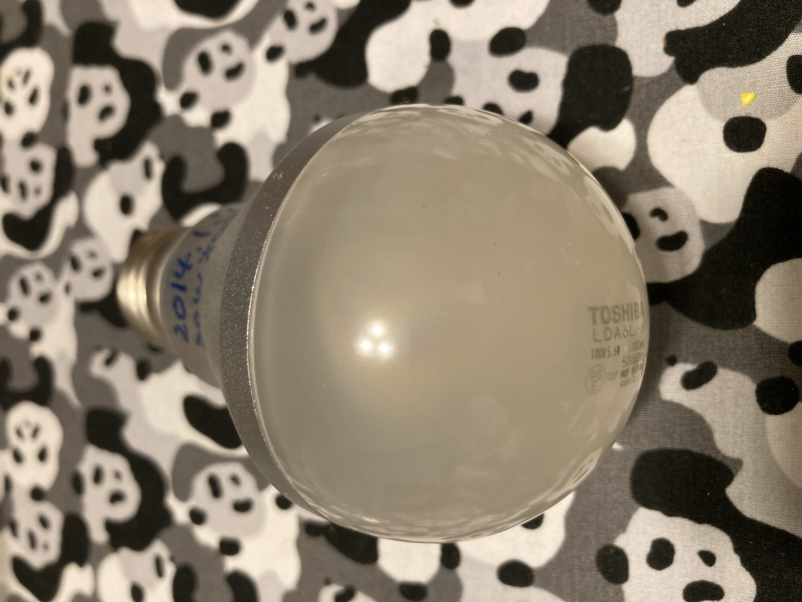
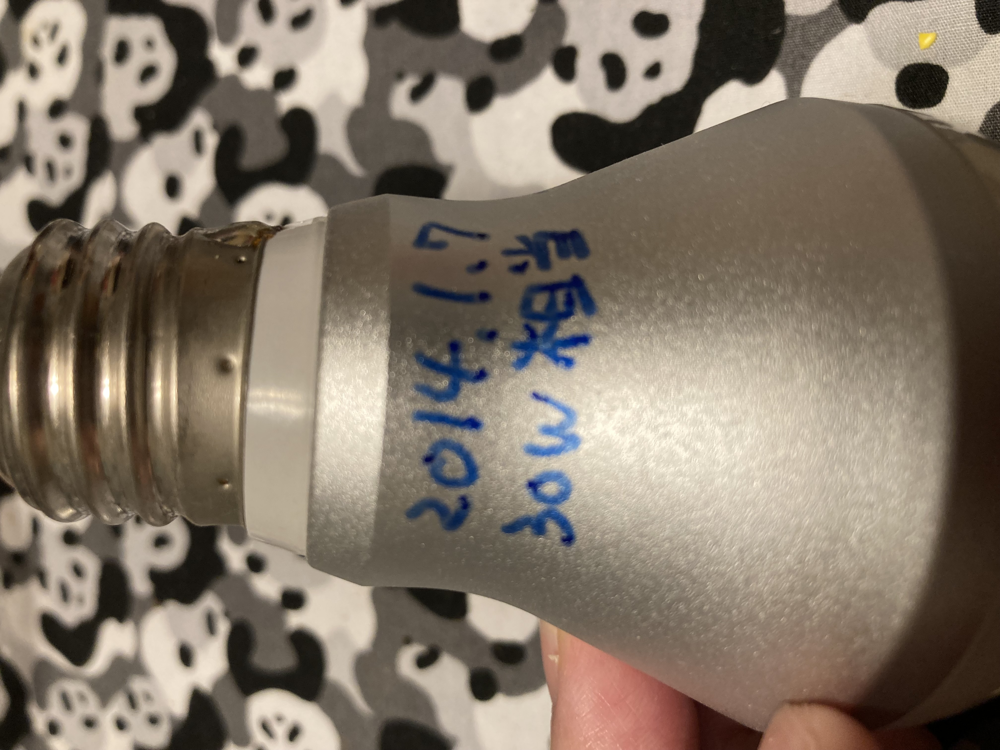

# LED電球取り替え

ときどき電球の取り替えをしているんですけどね。最近は点灯しなくなることはほとんどないな。「単に暗くなる」ことが多いか。

今回はこいつだ。色々なところに使いまわされて最終的に常夜灯的なポジションのダウンライトについていたもの。暗いのも暗いんだろうけど、色が悪くなってしまってな...メーカーは東芝。

だいたい電球の類をインストールするときは日付を書いています。書いてあるのをみると、2014.1.7 30W相当 5.6W 380lm とのこと。

確か値段は1000円以下のはずで、それを8年以上使ったんだったらまあ満足かな。替えの電球は写真ありませんが、パナソニックの「60W相当」の電球色のをハメました。東芝の方が色味が自然なので好きなんだが、最近売ってないんだよな。経営がアホだとそうなる...

ちなみにそのパナソニックの電球は大学の電気スタンドについていたんですが60Wだと「暗い」のでお役御免になって家に帰ってきました。大学の電気スタンドには代わりに100W相当の電球がいくはずです。