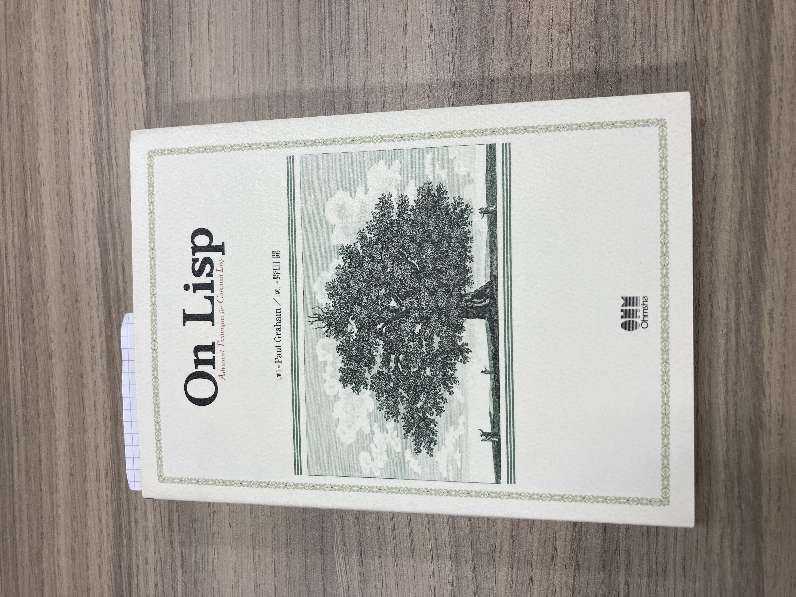

# On Lisp

2022.03.18 
だいたい毎日投稿することにしているんですが、昨日はバタバタしてできませんでした。
まあそういうこともある。

で、年度末でギッコンバッタンしていて、気持ちの余裕がないのですが、Lispの勉強は
On Lispを読むことにして、ちょっとずつ読んでいます。

読んでいてどうかというと、いまのところ「それって他の言語でもできるんじゃないの」
という疑問が払拭できませんが、そこはまだわかってないわけなので、我慢して読んでいます。

この本読んでて一番いいのは忙しくても「俺いまLispの勉強しているからな」とおもうと
気持ちが楽になるというか、よりどころになるというか、そんなところですね ^^;

年度末終わっても新年度もバタバタするんだよなあ...年度に関係ない職に戻りたい
(かわりに開発期限に関係あったりするわけですが)