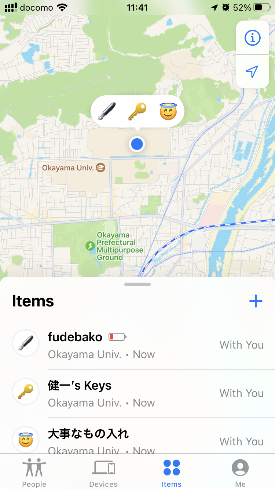
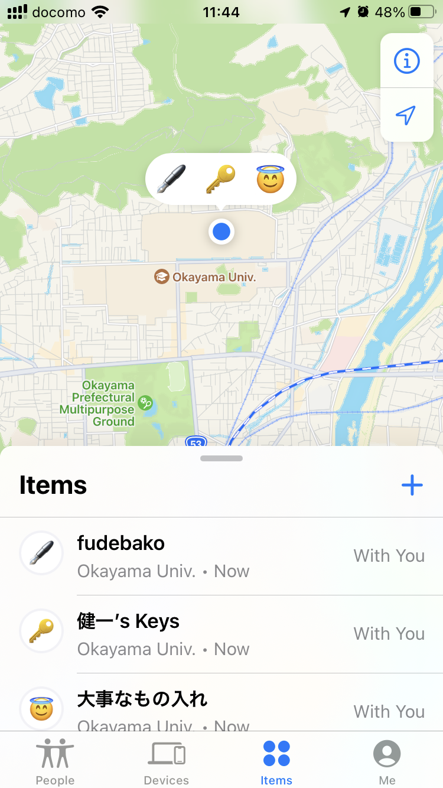

# AirTagの電池

2022.03.25 
AirTagを３つほど使ってるんですけど。ひとつ電池残量がないみたい。
似たような使い方しているのになぜ一つだけ。

しかたないので電池のフタあけてなにが入ってるのかみたんですけど、
CR2032って言うすごく普通のボタン電池。100均でも買える。

ところが、フタ開けてしめたら警告表示が消えてしまった。まあよくある話。
本格的に電池がなくなったら本格的に警告が出るんですかね? ^^;

