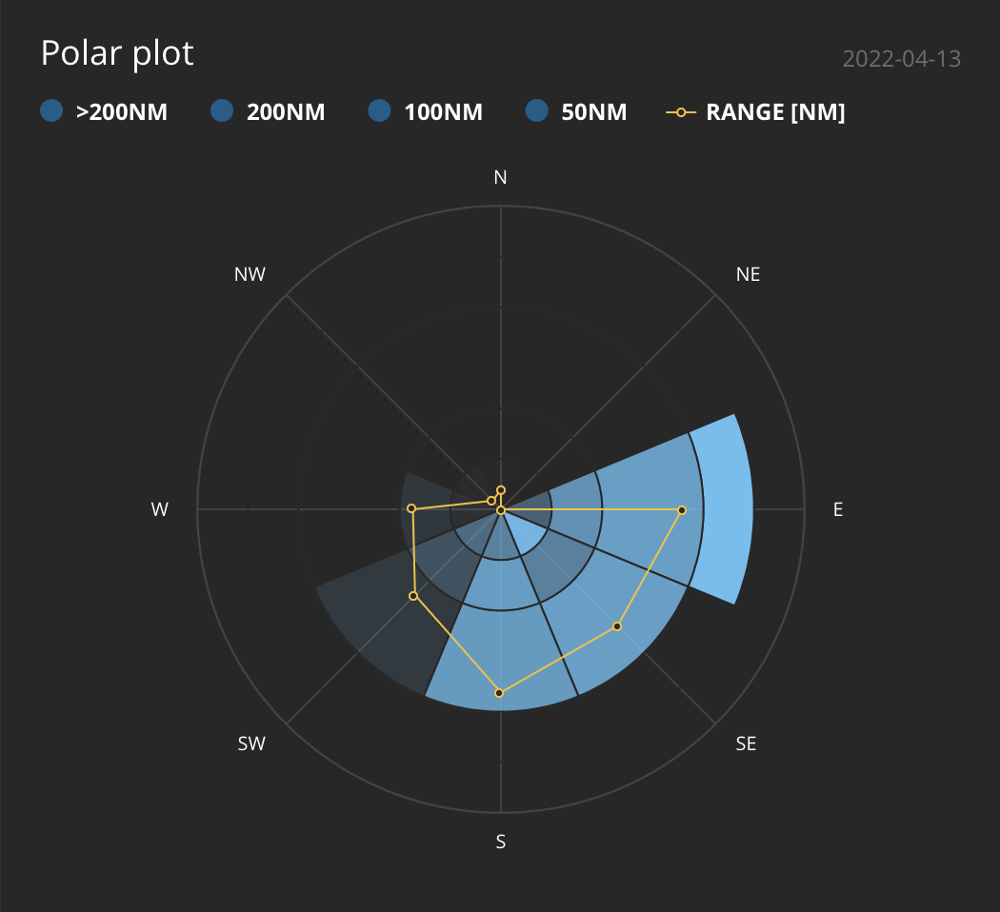
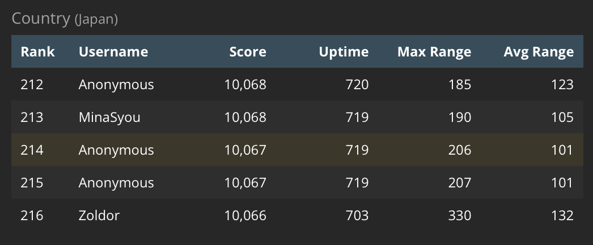

# Flightradar24

2022.04.13 
Flightradar24にフィードしてるんですが。アンテナの様子はこんな感じ。
大学のビルの6Fです。ほぼ南向き。

受信の様子はこんな感じ。窓が微妙に南東向きなんですかね?
場所的に東西方向の航路の下にあるというのもあるとおもいます。受信能力があっても、
そこを飛行機が飛んでいなければ受信できないので。

ランキングを見ると、日本の中での順位は 215番ぐらい。Uptimeが過去30日でのuptime
(日本語でなんていうの? 稼働時間?)で、Max Range
が受信した飛行機までの距離の最大値の平均らしい。206nm (海里)ってだいたい400km
ぐらいでそんなとおくから受信してんのね。Avg Rangeが平均距離。

スコアはUptimeとMax RangeとAvg Rangeから換算されたもので、
それで順位がついているようだ。
まあとりあえず有料版でFlightradar24が見られれば満足なので、
ランキング争いをする気はないかな... ^^;