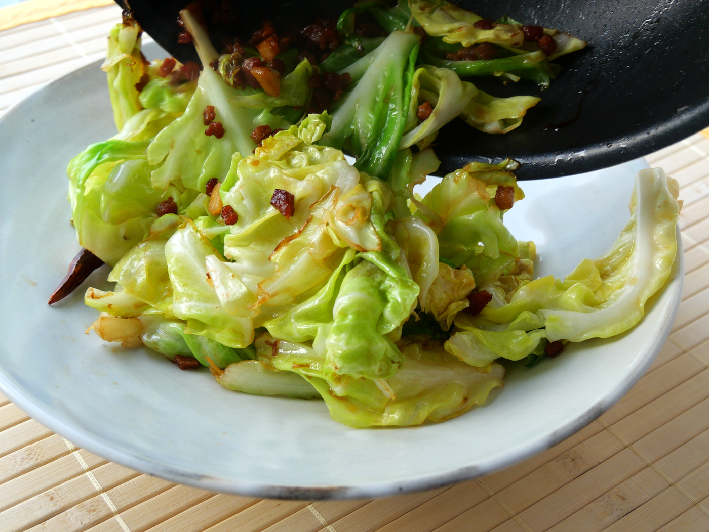

# キャベツと肉カスのラード炒め

百瀬さんに教えてもらって、下記リンクの料理を作ってみたんですよ。
「キャベツと肉カスのラード炒め」。中華料理で油渣蓮白というらしい。

これが思いのほかうまいんですよね。何がうまいって、ラードがうまい。
とてもいい匂いがする。たべたあとも1日ぐらい香る感じ。すごいね。
とりたてのラードがこんなにうまいなんて知らなかったな。脂だから
腹持ちも良くていいです。おすすめ。

[油渣蓮白レシピ](https://80c.jp/recipe/20220330-1.html)