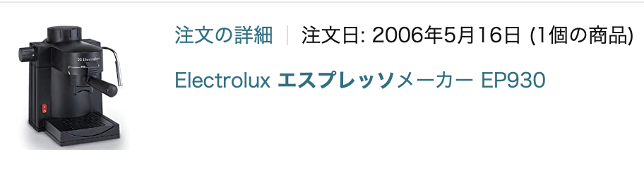

# エスプレッソメーカー

2022.5.3 
高校の準備室の片付けをしているんですが。コーヒーメーカーがふたつありましてね。

ひとつは従兄弟の結婚式に引き出物でもらったメリタのドリップ式のやつ。
もらったのは90年ぐらいの話なので、かれこれ30年近く使ってるかな。
まだ、高校に行った時は毎朝使ってます。

もうひとつはエスプレッソメーカーで、これは、エレクトロラックスです。
いつごろ買ったのかな。
いまアマゾンに聞いてみたら2006年5月16日らしいです。6年前か?
とおもったら、16年前も前かよ。
Time waits for no one, no favors has he.

これ、わりとおいしく入れられるんですが、
最近ちょっとめんどくさい気分になってて使ってないんですよね。
水を計量したり、豆を挽いたりしないといけないので。
だいたいここのところあまり高校にいないですよね。

というわけで、16年間ありがとうと唱えながらゴミ捨て場にバイバイしました ^^;
とりあえずエスプレッソはネスプレッソでいいかな...

