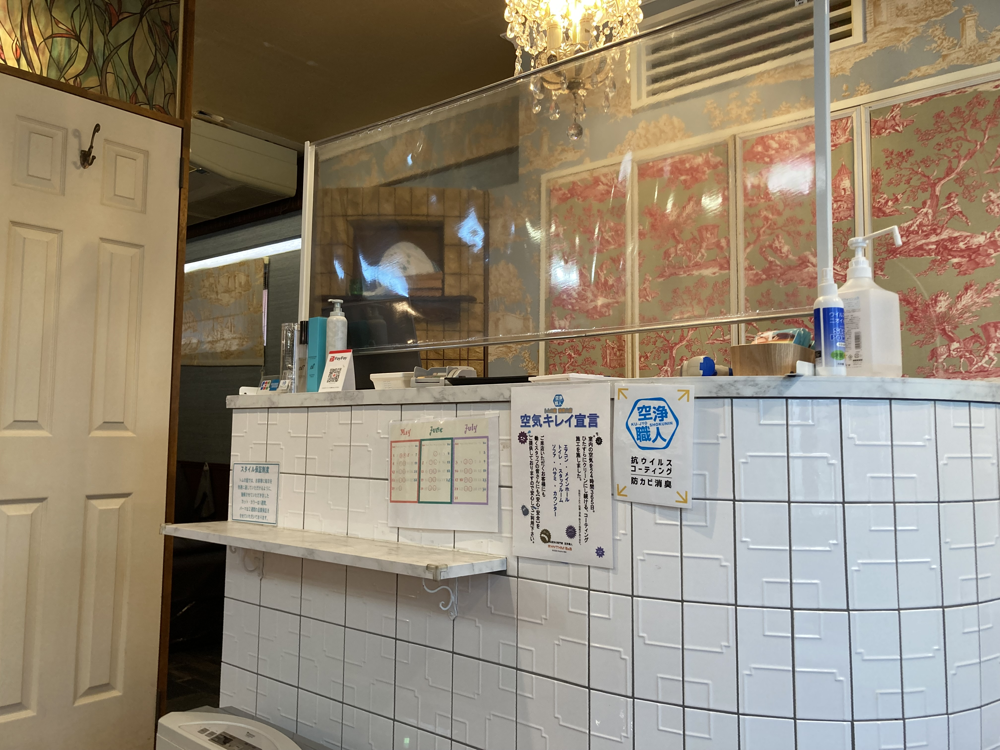
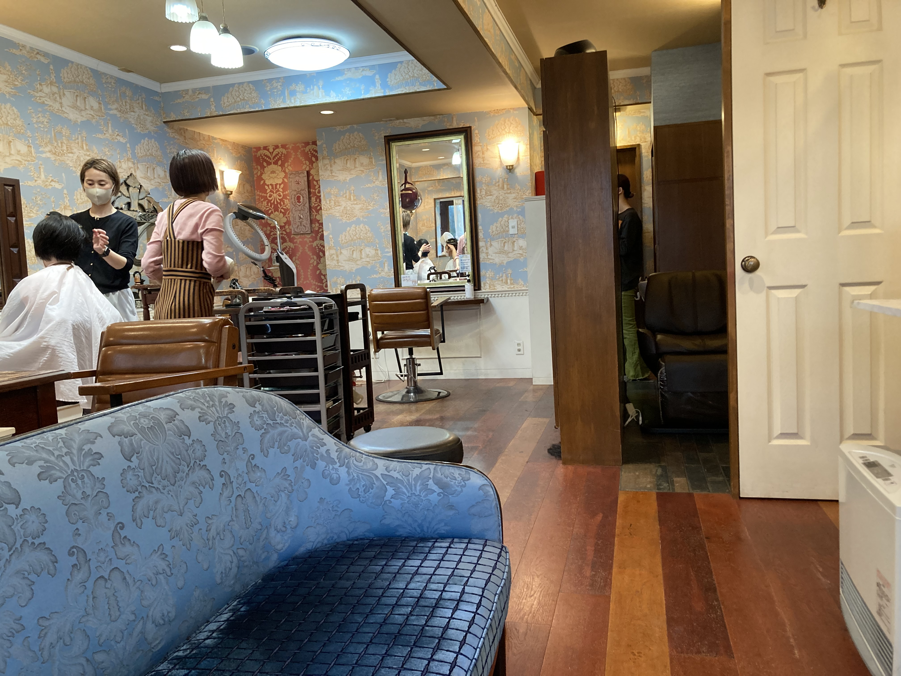

# 美容院

2022.5.8 
東京に来て時間があったら美容院に行くようにしています。南青山にあるトムの庭という美容院で、
たぶん2011年に日下部先生に紹介してもらいました。
日下部先生がアスキーにお勤めだった時からずっといるおじさんの美容師さんがいるんですよね。
それって50年ぐらい前じゃないですか? びっくりですよね? (いいすぎ ^^;

娘を連れてよく行くんですが、今回も娘と行きました。なんかバッサリ切ってた ^^;
昨日は3歳ぐらいの小さいお嬢さん連れてきてたお客さんが来てて、
美容師さんに「小さいお嬢さん懐かしいでしょう」といわれたんですが、
ほんとにねえ、つい先日まで3歳ぐらいだったのに、いつのまにおおきくなったのか ^^;
びっくりするばかりです ^^;

