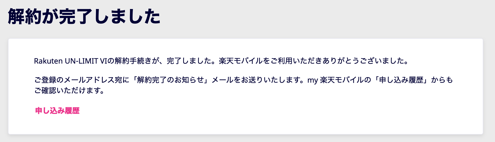

# 楽天モバイル

2022.5.18 
たしか、2020年の11月に、友人に誘われて楽天モバイルに加入したんですけど。
まずね、電波が入らない。岡山の私の家は、地図上ではバリバリ楽天エリアなんだけど、
電波をつかまない。サポートに問い合わせても「屋内だと入らない可能性ありますから、
屋外でやってください」そんなわけあるか ^^;

auとローミングしているのでそっちで繋がるんですけどね。5GB/月しかないんですよ。
アンリミットとはなんなのか。auリミテッドの間違いじゃないのか。

都内はまあまあ繋がる。たまにおかしいけど。機内モードオンオフすると直ります。
友人の家は京都なんだけど京都も大阪もつながらないらしい。

そんなこんなで最初の半年ぐらいでもう使うの諦めちゃって、
副回線で置いとくだけになっちゃってたんですが、
ちゃんと調べてないけど最近岡山でもauのローミングが外れたらしく、電波の棒が
楽天の電波状況をあらわしてるんですが、「1本」なんですよ。ひどい。
21世紀になってから山の中でもないのに電波が1本なんて見たことないです　^^;

最近のニュースで近々有料になるらしいんでさっそく解約しました。
利用期間は約1年半だったかな。なお解約の手続きは簡単でした。
まあまあ面白かったです、楽天モバイル ^^;

