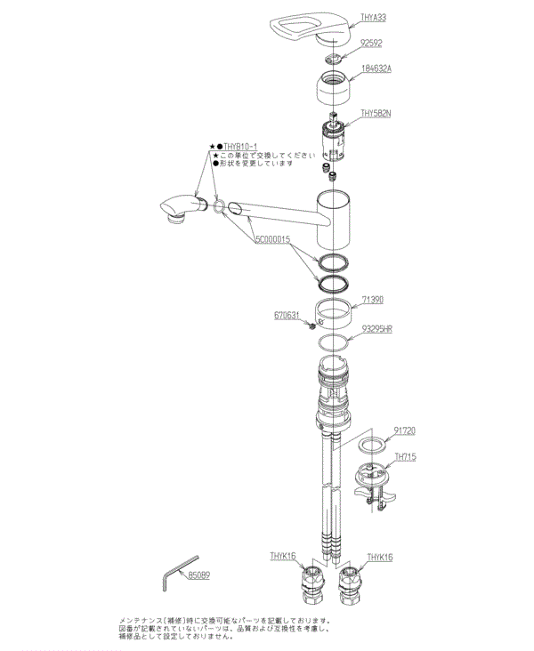

# 蛇口のバルブ

2022.5.23 
今のマンションは、001年1月に入居したのでそろそろ20年になるんですが、
そろそろあちこちが交換時期です。そのひとつが台所の水道の蛇口で、
バルブとハンドルがおかしい。

まず、すっと閉めただけでは水が止まらず、ぽたっぽたっ、(あるいは、つー ^^;)
となるようになってきました。これはバルブのカートリッジ交換でよさそう。

もうひとつは、ハンドルのガタがおおきくなってきて、ハンドル操作をすると
遊びが多すぎる。さらには、ちょっと引っ張るとガコッと外れてしまう ^^;

型番は「TKG31UPX」でTOTO製らしい。分解図はこう。

THY582Nがバルブのカートリッジで、THYA33がハンドル。両方アマゾンで書いました。
カートリッジが5500円ぐらい、ハンドルが3000円弱。

交換の手順はここの動画をみました。

[ＴＯＴＯ製シングルレバー水栓のカートリッジの交換方法](https://youtu.be/oEbGtZAn_t4)

そんなに難しいこともなく、20分ぐらいで終わりました。水を出したり止めたりが超快適 ^^;
入居してすぐって、こんなだったかしら... ^^;