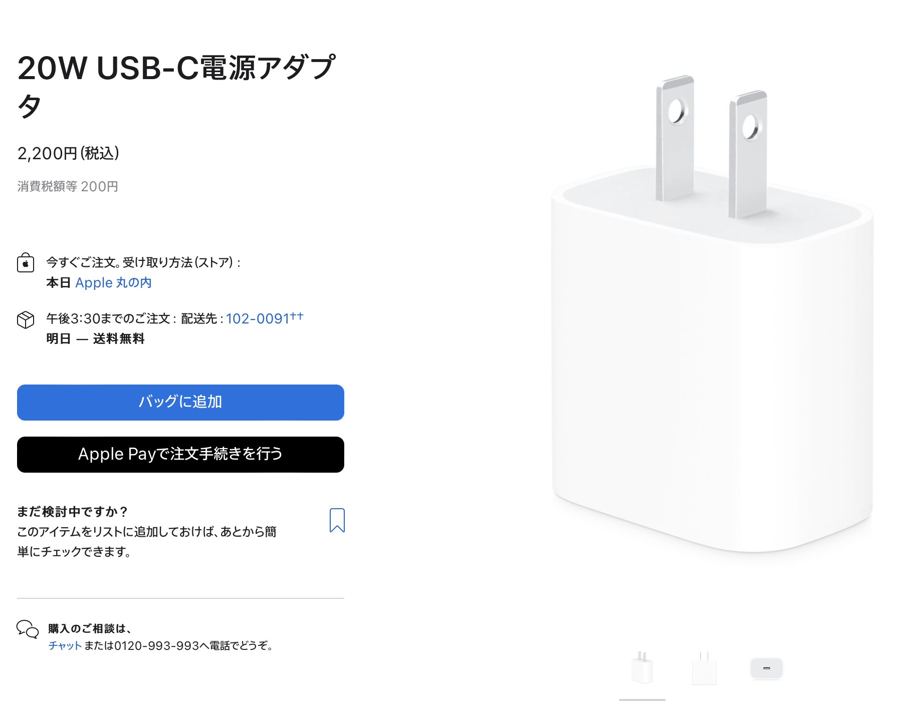

# 充電器

2022.6.3 
USBの出力がある充電器、Ankerの薄型でケーブルが生えてるやつを愛用してたんですけど。
よく考えたらUSB Type-Aの口は時々しか使わないんですよね。
最近だんだん使用頻度が下がってきてる。そこへもってきて、
妻がiPadを充電できる充電器はないかというので、
(iPhoneに付属の充電器だと、充電しながら使うとどんどん減るらしい ^^;)
使ってたのをあげました。これかな。

[Anker充電器](https://www.amazon.co.jp/gp/product/B08BYQ48F2/)

で、自分用に充電器が必要なんですが、小さいタイプにしました。小さくてカバンにも入れやすい。

[コンパクトなやつ](https://www.amazon.co.jp/gp/product/B08X11GD52/)

写真で見ると、大きいのか小さいのか微妙な感じですが、コロッとした形状なので、
収納はしやすいです。Apple純正のiPad用充電器と似たようなサイズかなと思います。

