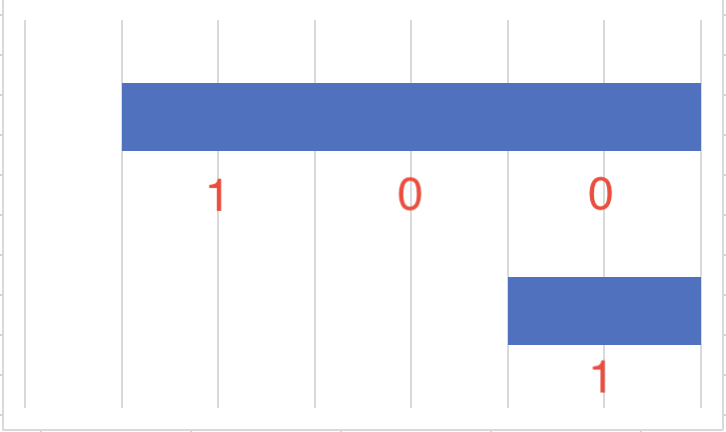
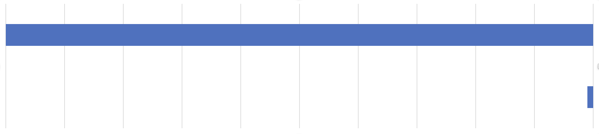

# 対数

2022.6.22 
対数ってよくできてますね。考えれば考えるほど好きなんですけど、まずね、
数字の位取り記数法がすごい。アラビア数字ですね。1、10、100というやつ。
中国文明だと数字は、一、十、百ですからね。アラビア数字は10倍、
100倍になっていることがひと目でわかり、各けたの数字が合わせやすい。すごい発明。

これ、10倍になると1ケタふえるので、対数的なんですね。おかげで、
100を短く表記できる上に、ちゃんとケタもあわせられる。ただ、
このせいかどうかはわかんないけど、結構な数の人が、
1と100の関係を把握していないような気がしています。

「いち」「ひゃく」といった時にアラビア数字で「1」「100」を思い浮かべているので、
こんな感じのイメージで捉えている可能性がある。

もちろんこのイメージは誤りで、実際の100倍はこうだ。

1と1000、1と10000となるとますます直感的な把握は難しくなる。
これ、心理学の実験手法で確かめられませんかね? ^^; > だれとはなく