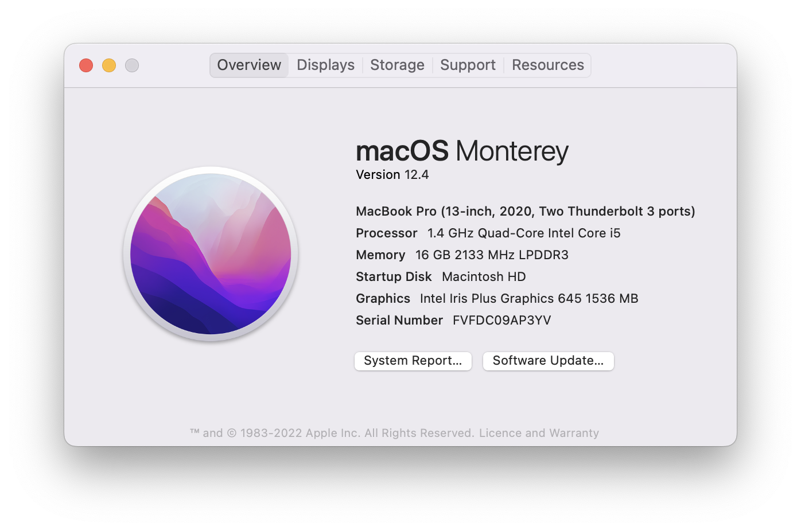
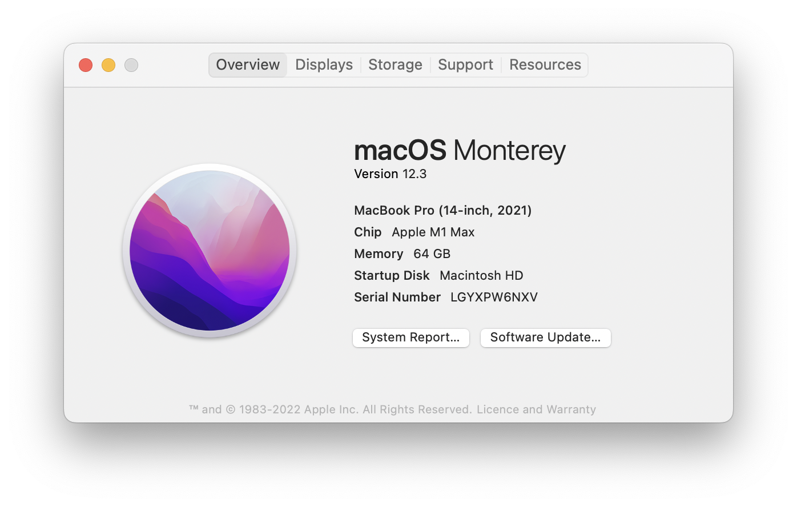

# MacBook Proおひっこし

2022.7.2 
訳あって、MacBook Pro 14インチ2022 (M1) からMacBook Pro 13インチ2020 (Intel) に本格的に引っ越ししました。

外付けSSDのTimeMachine経由です。マイグレーションはすぐに終わりました。
普通に使っている分にはあまり違いは感じませんね。筐体がちょっと熱いぐらいか ^^;
M2 MacBook Airが出たら自制できる自信はありません ^^;