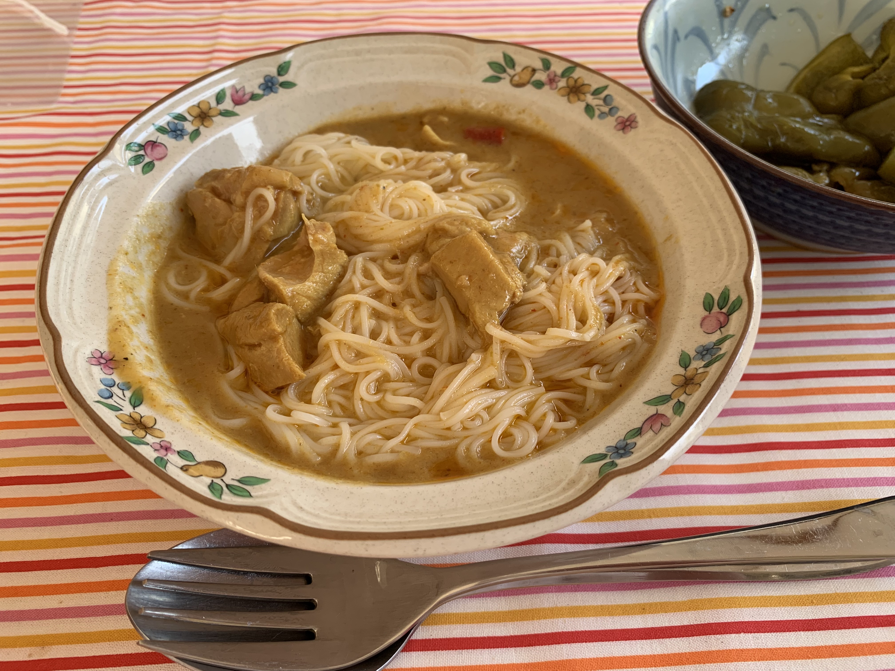
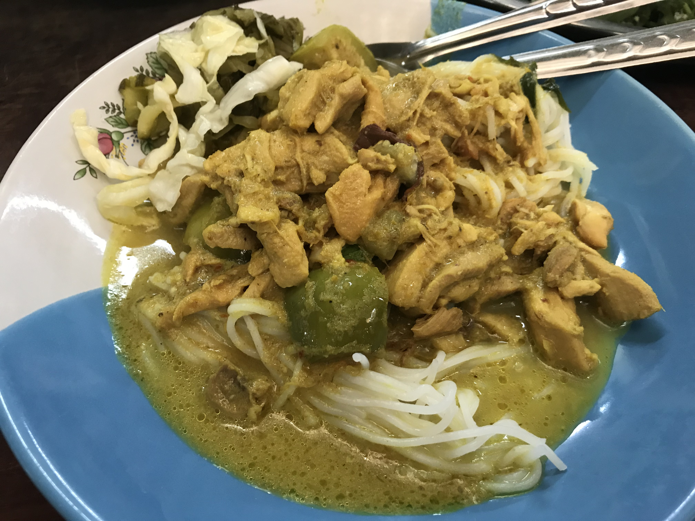

# カノムチーン

2022.8.7 
いなばのタイカレー缶を買ってきたので、カノムチーンにしてみました。そうめんをゆでて、タイカレーかけたらだいたいカノムチーンです。厳密にはそうめんじゃなくて、米粉を水に溶いたものを、ところてん式に押し出す器具でお湯に出して作るらしいんですが、タイ人もそうめんで代用するのでOK。

タイで食べたカノムチーンはこんな感じ。2018年12月、ホワヒンにて。

