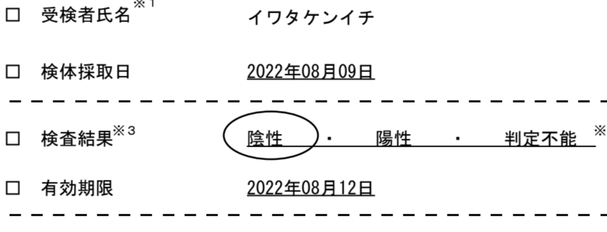

# PCR

2022.8.10 
日曜の昼ぐらいから、断続的に気のせいかも? っていうぐらいの喉の違和感があり、いや喉の違和感はない! と言い聞かせながら、無料PCRにいってきました。

まず月曜日に、県のページでみつけた、歩いて行ける会場 (普通の調剤薬局) に直接行ってみると、「予約がないとダメ」「今週は予約がいっぱい」とのことで断念。暑い中歩いて行ったのに ^^;

つぎになかさんにおしえてもらったドライブスルーの無料PCR検査、こっちはweb予約できました。翌日の午前中。車でいくと3列に駐車するようになっており、車をとめると係員が出てくる。説明を受け、記入用紙と唾液を入れるようの容器をもらい、できたらハザードをたけとのこと。

結果は当日の深夜から翌日の朝にメールでしらせるとのことで、ぶじ陰性でした。その間、体温はだいたい36.4〜36.9ぐらいの間。

まあ陰性でよかったので、ひきつづき、体調に気をつけて生活していきたいと思います ^^;

