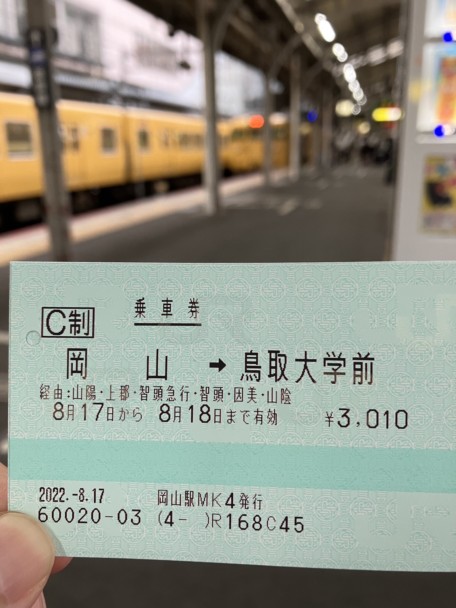

# 列車移動

2022.8.17 
車で移動できる時は、岡山から鳥取まで下道で2.5時間、120kmぐらいなんですけど。車が使えないと列車を使うしかない。岡山から山陽本線、智頭急行線を通る経路で「スーパーいなば」ってのが走っていて、所要時間2時間弱です。

今日は、お客はあんまり乗ってなかったな。10人ほど。2両編成。

大学のすぐ前に駅ができたので (1995年)、便利です。朝イチの6時46分岡山駅発で、大学に着くのが9時ちょっと過ぎぐらい。

まあ中国山地を縦断するので、ずっと山の中を走るんですが、山、山、田んぼ、家、川、山、山、という感じ。すごいね ^^; 鳥取に到着したら、うわー都会に着いたー、っていう ^^;