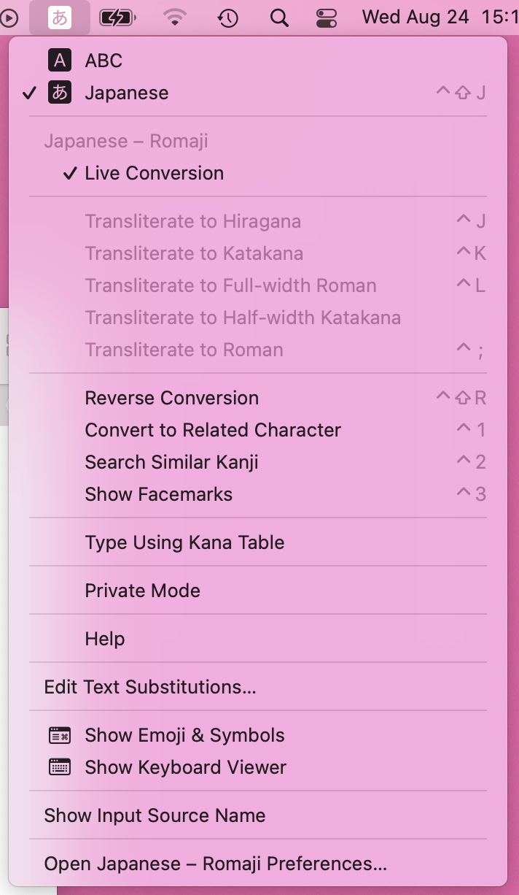

# Live変換

2022.8.24 
Macの日本語変換がことえりじゃなくなった頃だったと思うのですが、Live Conversion (日本語だとライブ変換?) ってのがついたんですが、遅いし使いにいしで、数日試してオフにして、そのままずっとオフだったんですけど。日下部先生がライブ変換を使っているっていうので、そうなの? と思って今日からまた使ってみてるんですけど。

やっぱり使いにくいんですね。なんで使いにくいのかなと考えたんですが、

タイプしていくと自動で変換されるんですが、それはいいんだけど、説明が難しいんですが、タイプするにつれて変換が勝手に変わるんですよ。例えば、「へんかん」と打つと「変換」になり、続けて「が」を打つと「へんかんが」になる。

頭の中の動きを観察したんですが、変換して正しい候補が出たら、頭の中ではもうそこは「確定」で、忘れてしまって、次のタイプ、次の変換のことを考えているんですが、「お、いいね、確定」とおもったあとで再度変換されてしまうので違和感があるんだと思う。

「へんかん」と入力し、「変換」と表示されたので、お、あってるね! とおもって「が」を入力して素早く確定すると「へんかんが」で確定されるんですよ。ひどくないですか ^^;

そうじゃなくて、文章一区切りするまで長く打って、戻って変換し直して確定していくスタイルなら使えるかというと、そうでもなくて、一定程度長くタイプすると、先頭から勝手に確定していくのだ! なんということだ!

というわけで再度オフかな... ^^;

とにかく、モードの切り替え (日本語入力と英語入力の切り替え)とかな漢字変換が日本人の平均寿命を20年ぐらい縮めてると思います。なんとかしたい ^^;

