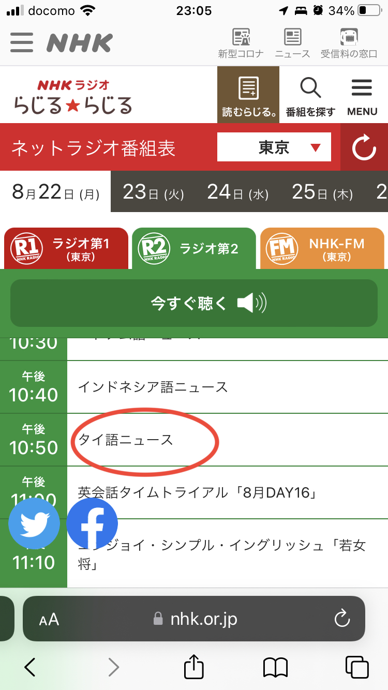

# タイ語ニュース

2022.8.26 
最近、寂しいのでラジオを聞いているんですよ。テレビはあるけど協会の放送を受信できる状態にないんです。主にMacの外部ディスプレイとして使っています ^^; そんで番組表見てたら、いまって、NHKラジオでタイ語のニュースやってるのね。10分間だけど。

ラジオはソニーのICZ-R51というので2013年に娘が中一だったのでラジオ基礎英語を聞こうぜと言って買った、ICレコーダーでタイマー録音もできるすごい奴です。ただこれマンションだとラジオの受信状態が悪くて使い物にならないんだよな。鳥取は木造なので10年越しに役に立つ感じ。

それでタイ語ニュースを聞いてるんですが、そうすると、語彙が絶対的に不足しているので、発語された単語のうち1/10ぐらいしかわからない。したがって内容はちっともわからないんですが、タイ語は聞いてると和むからいいよな。

なんとスクリプトも公開されているので、辞書ひきながら読むと語学的には良さそうだが、そこまでの元気がない ^^; またタイに行くことがあるかどうかもわかんないしなー ^^;

ムアンタイ遠くにありて思うもの (季語:ムアンタイ、夏)

