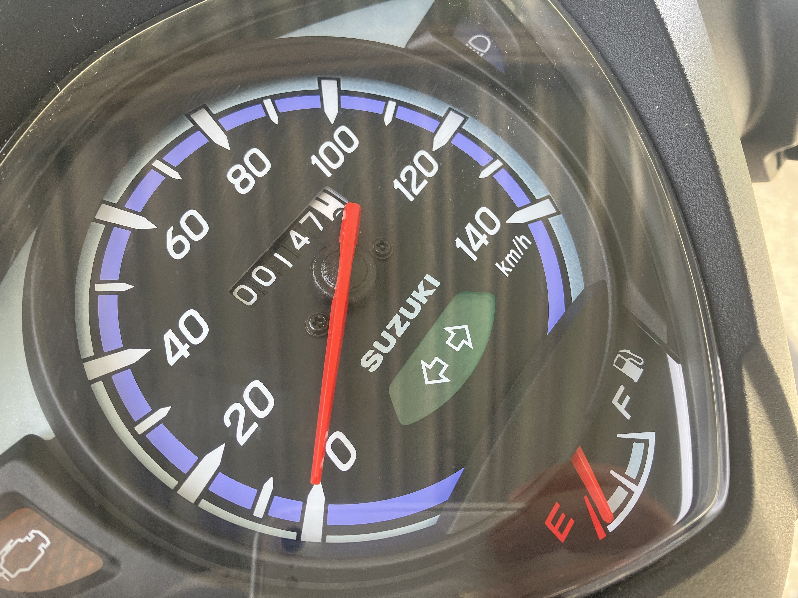

# ならし運転中

2022.9.8 
まだ元気ないんですが ^^; 結局ギリギリまでかかってしまうんだろうな...科研の申請。

オートバイの慣らし運転をしています。だいたいスロットル開度1/3から1/2制限です。
すると平地で60km/hは出ないぐらい。昨日、長い坂道で30km/hを切りそうになって、
止まるかと思いました ^^;

1000kmまでやるらしいんだけど、大変だな...

なんとなくだけど、アタリがついてきたような気もする。気のせいかも。

