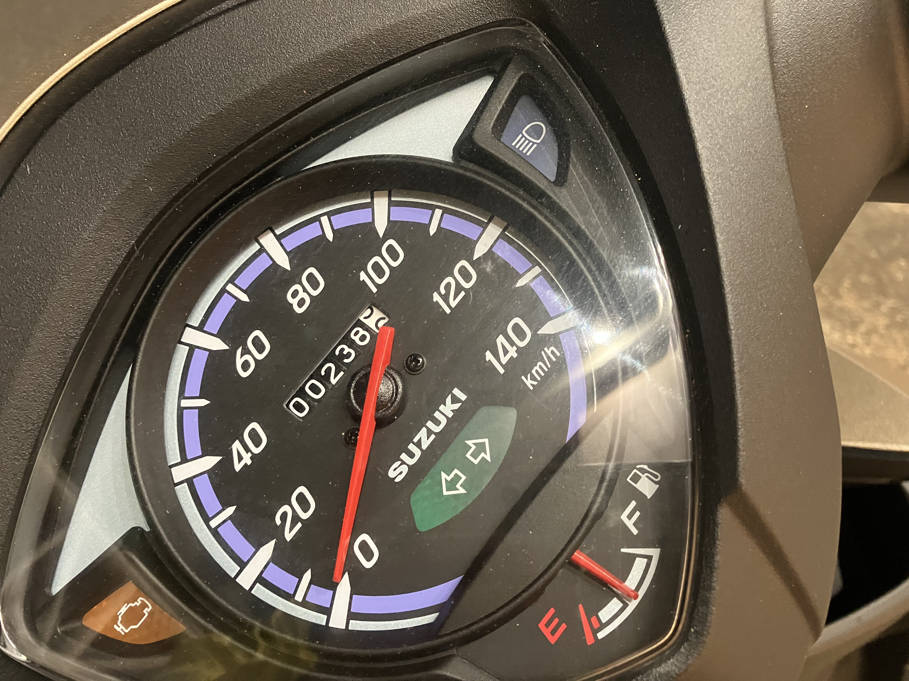
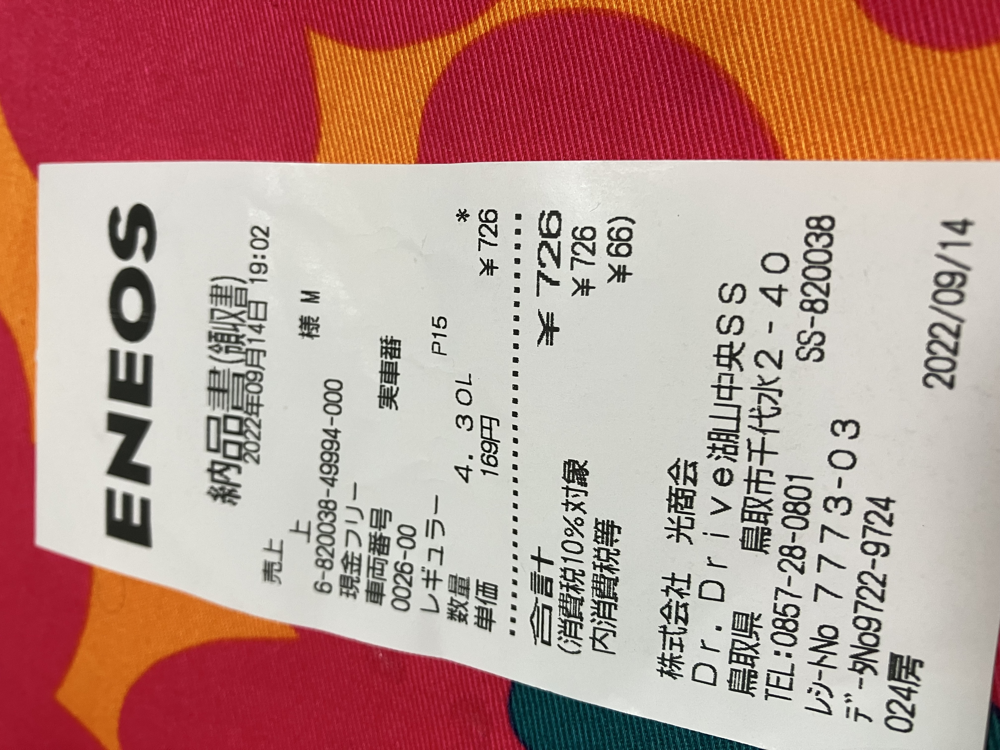

# 燃費

結局科研の申請はギリです (明日の正午) ^^;

今日、オートバイに2回目の給油をしたんですが、だいたい230kmぐらい走って、4.3L入ったので、燃費53.5km/Lぐらい。ベルト駆動にしては優秀なんじゃないかと思います。

まあまだならし運転中なので、アクセル開度1/2制限中ですけど。もっと開けていくとどうなるか分かりません。

給油するときに財布とか出すのが面倒なので、キーホルダーについてるエネオスのエネキーで給油できるガソリンスタンドを検索していったのですが、到着してみたらまさかのフルサービスで、気が動転して現金で払いましたw

