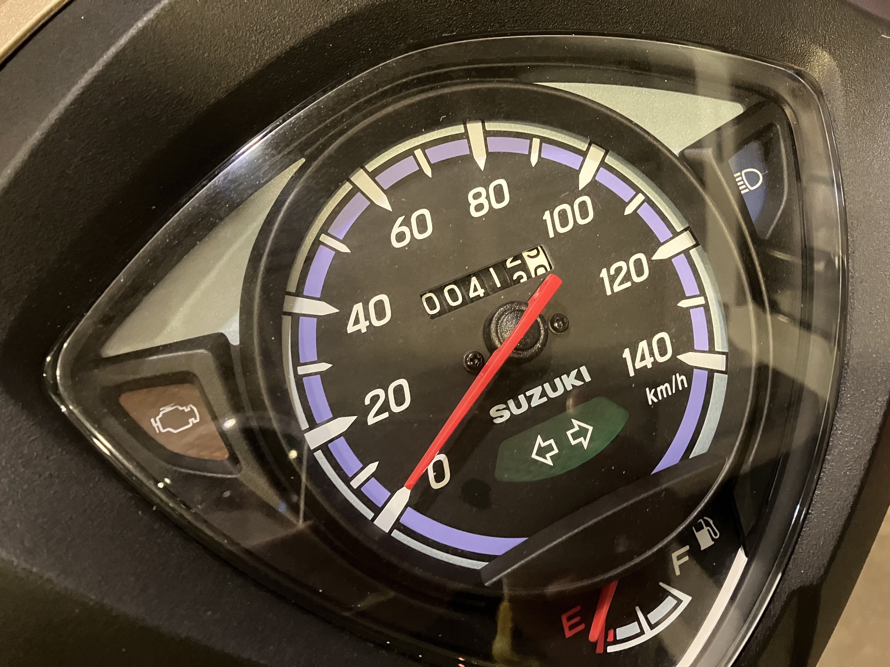

# 燃費

昨日、オートバイに3回目の給油をしました。2回目は9月14日だったらしい。1回目は8月29日。普通の使い方で、1か月は持たないかなという感じ。まあタンク5Lだからね。

前回の給油時のオドメータは238.6km 今回413.0km。つまり174.4km走行して、4.52L入ったので、燃費は38.6km/Lぐらい。前回53.5km/Lぐらいはしったのでえらい燃費悪いんですが、満タン法の誤差か (前回はフルサービスのスタンドで入れてもらったが、今回のように自分で入れる時は口までいっぱいにいれるので)最近タイヤの空気圧をみていないので、低くなっているかのどっちかかな。

メーター付きの米バルブ口金の自転車用手押しポンプ (具体的にはパナレーサーのやつ) が欲しいなと思ってます。

まだまだならし運転中なので、アクセル開度1/2制限中です。

今回は無事、エネオスでエネキー! で給油できましたw

