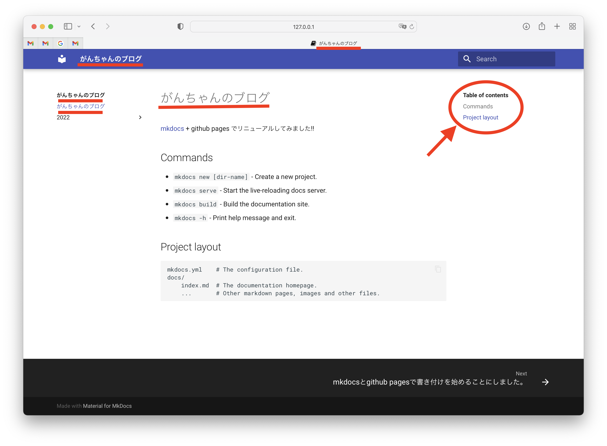

# mkdocsとgithub pagesで書き付けを始めることにしました。

2022.03.09
河野先生が「ブログは毎日書くのがいい」と言っていて、まあ10年ぐらいずっと聞いてたんですが、急に刺さってしまい。
ほったらかしてあるブログサイトも (多数... ^^;) あるのですが、いまさらblogspotとかwordpressも嫌だなとか思って
新しいことを探索してみました。

SSG (Static Site Generation) というのがあるらしく、手元でマークダウンでドキュメントを書いて、ツールでHTMLや
リンクを生成するらしい。いいじゃん。Hugoというのがメジャーなようだけど、ローカルにインストールが必要で、なおかつ
標準がHomebrew。Homebrewなんか嫌いなんだよな。というわけで他にツールがないかいろいろさがしまわって、mkdocs。これだ。
pipでインストールは必要だけどそれだけなので敷居が低い。

参考にしたのはこの辺り 
[https://himenon.github.io/blog/static-site-generator/](https://himenon.github.io/blog/static-site-generator/
) 
[https://aiedoc.github.io/note/Tips/Mkdocs/mkdocsを使ったGitHubPages/](https://aiedoc.github.io/note/Tips/Mkdocs/mkdocsを使ったGitHubPages/
) 
[https://zenn.dev/mebiusbox/articles/81d977a72cee01](https://zenn.dev/mebiusbox/articles/81d977a72cee01) 
[https://www.manj.io/blog/2021/mkdocs-as-blog/](https://www.manj.io/blog/2021/mkdocs-as-blog/) 

mkdocsのサイト 
[https://www.mkdocs.org](https://www.mkdocs.org)

マークダウンがまだわからん ^^; 
[マークダウン一覧](https://gist.github.com/mignonstyle/083c9e1651d7734f84c99b8cf49d57fa)

できたのはここ。 
[がんちゃんのブログ](https://kenic.github.io/)

イメージはこんな感じ。 

「がんちゃんのブログ」が計５つも表示されているのと、右上のリンクがよくわからない。とりあえず表示できているので
いいということにしてあとは明日以降だ ^^;