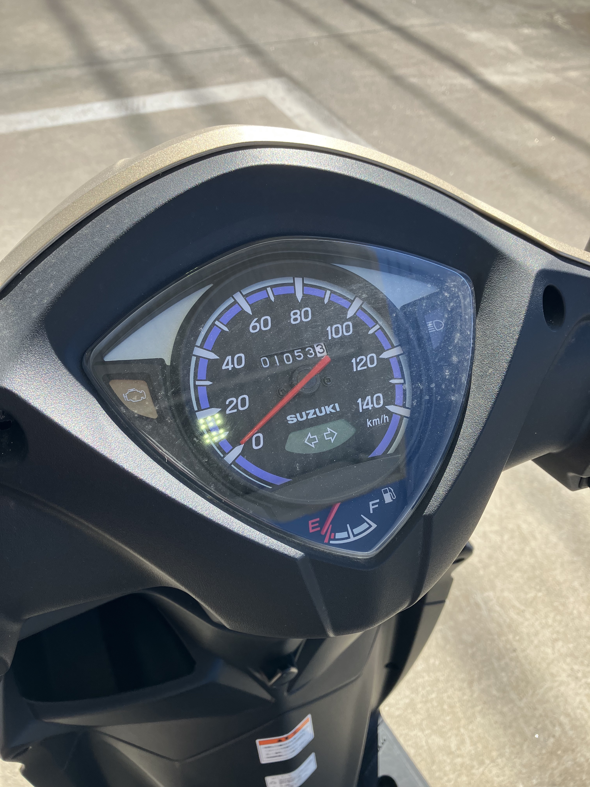

# 燃費6

2023.2.28 

今日オートバイに給油しました。7回目。

初回が購入日の8月29日。 
2回目は9月14日。238.5km 4.3L 53.5km/L 
3回目が10月7日。413.0km 4.52L 38.6km/L 
4回目が11月3日。571.6km 4.04L 39.3km/L 
5回目が11月30日。723.8km 4.36L 34.9km/L 
6回目が2月2日。883.1km 4.17L 38.2kmL 

今回はオドメータ1053.3km、走行距離170.2km 給油量4.42Lなので燃費38.5km/L。

春めいてきたせいか、冬の間はガソリンがなくなるまで2か月かかってたのが、1か月で空になりました。

