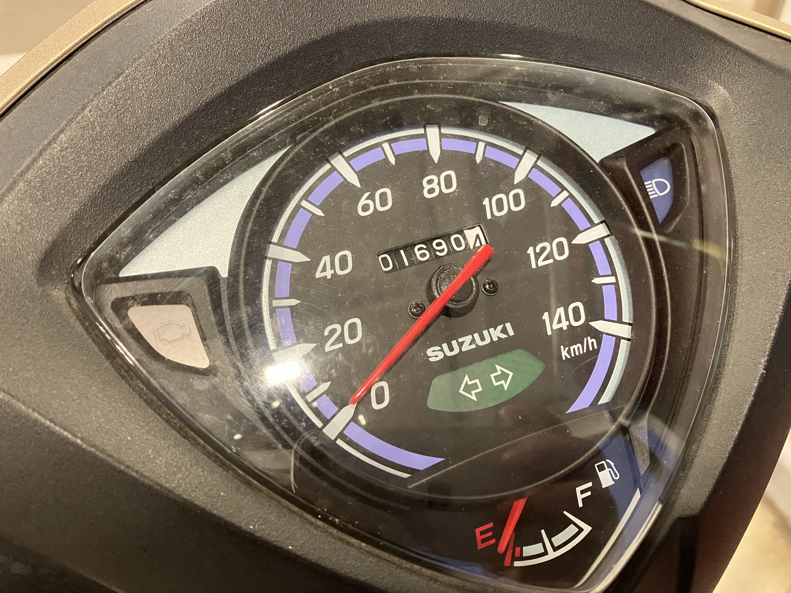
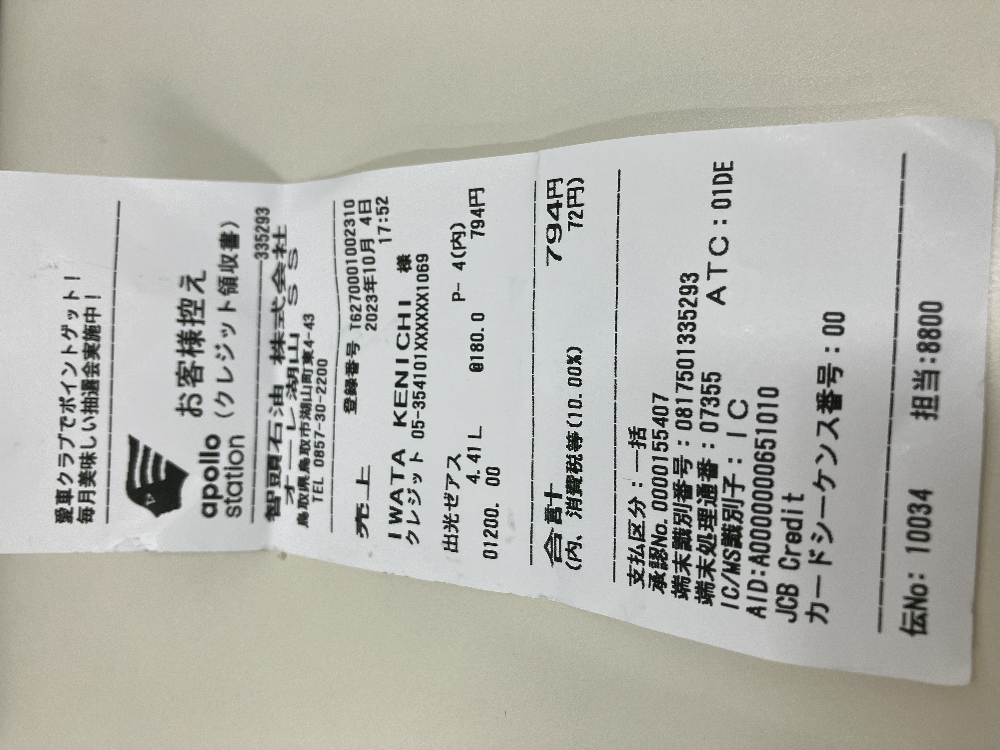

# 燃費10

2023.10.5 

昨日、オートバイに給油しました。11回目。

初回が購入日の8月29日。 
2回目は9月14日。238.5km 4.3L 53.5km/L 
3回目が10月7日。413.0km 4.52L 38.6km/L 
4回目が11月3日。571.6km 4.04L 39.3km/L 
5回目が11月30日。723.8km 4.36L 34.9km/L 
6回目が2月2日。883.1km 4.17L 38.2kmL 
7回目が2月28日。1053.3km 4.42L 38.5km/L 
8回目が3月31日。1205.5km 3.96L 38.4km/L 
9回目が6月9日。1348.1km 4.19L 34.0km/L 
10回目が8月8日。1518.6km 4.23L 40.3km/L 

今回はオドメータ1690.4km、走行距離171.8km 給油量4.41Lなので燃費40.0km/L。
夏は燃費がいいんですかね?

