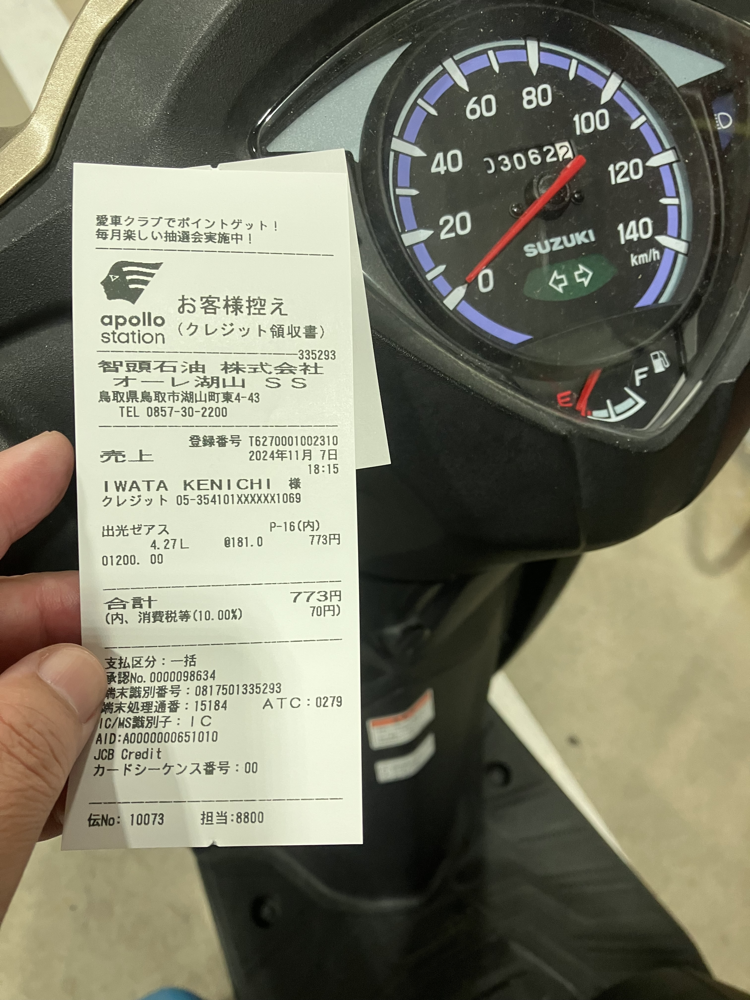

# 燃費18

2024.11.07 

今日、オートバイに給油しました。給油は19回目。

初回が購入日の8月29日。 
2回目は9月14日。238.5km 230kmぐらい 4.3L 53.5km/L 
3回目が10月7日。413.0km 174.5km 4.52L 38.6km/L 
4回目が11月3日。571.6km 158.6km 4.04L 39.3km/L 
5回目が11月30日。723.8km 152.2km 4.36L 34.9km/L 
6回目が2月2日。883.1km 159.3km 4.17L 38.2kmL 
7回目が2月28日。1053.3km 170.2km 4.42L 38.5km/L 
8回目が3月31日。1205.5km 152.2km 3.96L 38.4km/L 
9回目が6月9日。1348.1km 142.6km 4.19L 34.0km/L 
10回目が8月8日。1518.6km 170.5km 4.23L 40.3km/L 
11回目が10月5日。1690.4km 171.8km 4.41L 40.0km/L 
12回目が12月20日。1846.1km 155.7km 4.19L 37.2km/L 
13回目が3月11日。1986.7km 140.6km 3.86L 36.4km/L 
14回目が4月11日。2152.0km 165.3km 4.55L 36.3km/L 
15回目が5月30日。2313.9km 161.9km 4.35L 37.2km/L 
16回目が7月4日。2505.2km 191.3km 4.33L 44.2km/L 
17回目が8月21日。2706.3km 201.1km 5.05L 39.8km/L 
18回目が9月19日。2898.7km 192.4km 4.81L 40.9km/L 

今回はオドメータ3062.2km、走行距離163.5km 給油量4.27Lなので燃費38.3km/L。

