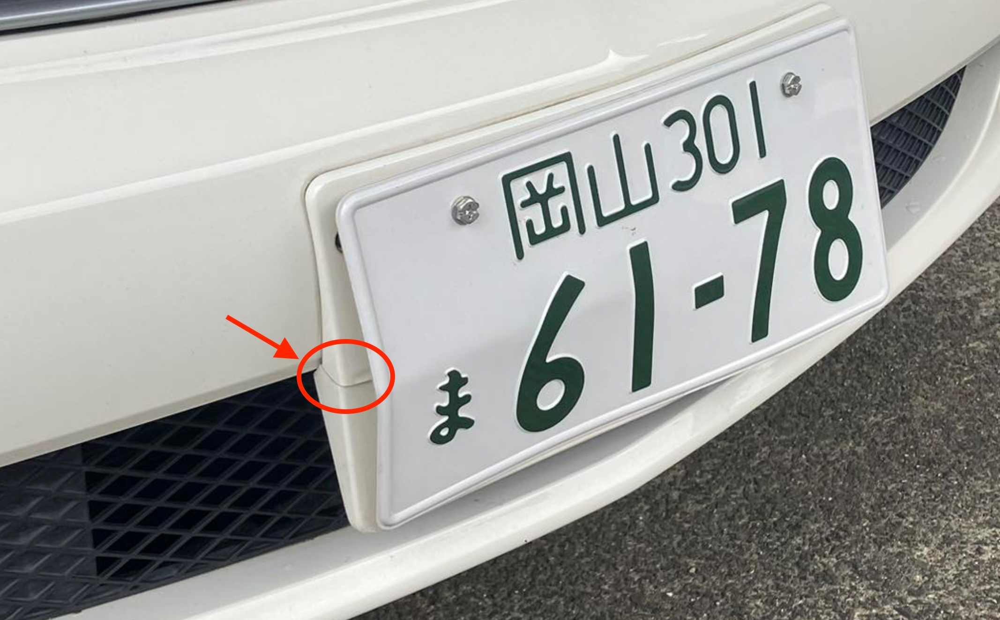

# 衝突

昨日、車で黒尾峠を鳥取側に向かって降りていたところ、とことこと道路を横断する
ケモノがおり、おそらくタヌキとおもわれたのですが、気がついてから1秒間逡巡したあと、
ブレーキをかけたのですが、間に合わず3秒後に衝突しました。

「轢死か...」とおもってミラーを見たところ、タヌキ? は立ち上がって歩いていたので、
怪我ぐらいで済んだっぽいのですが、家に帰って車を点検したところ、ナンバーが曲がっている
のと、ナンバーのステー? が割れていました...

工場の社長に電話したら「ナンバー再交付しましょう」とのことです。

報告は以上です ^^;
