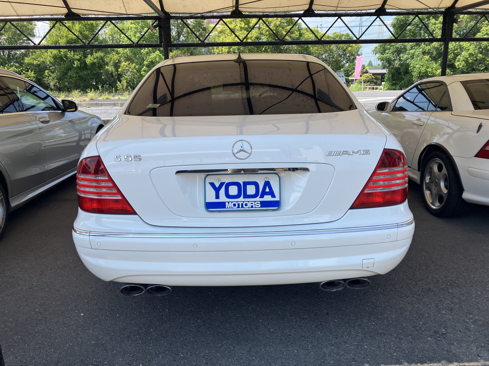
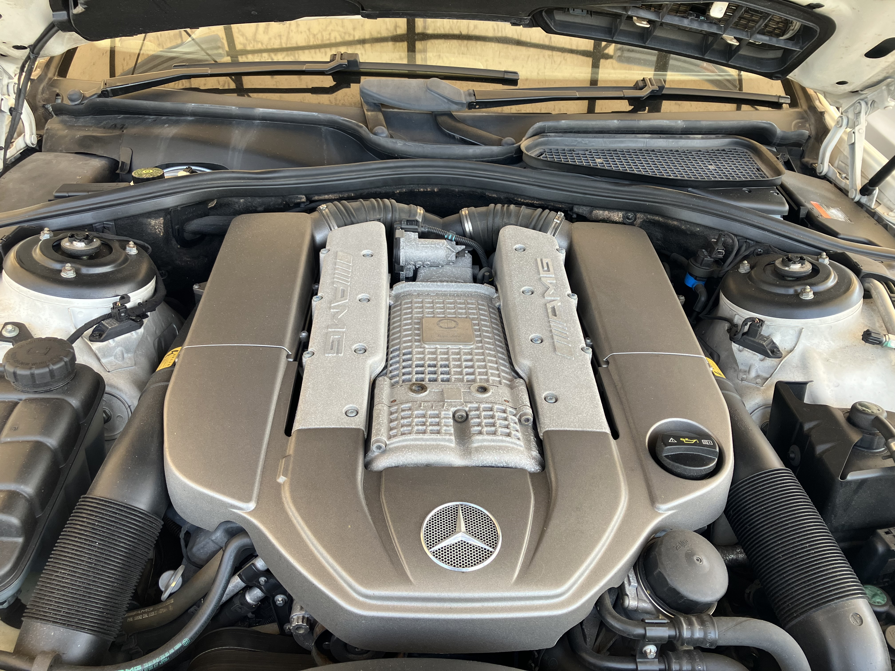

# S220 S55

出来心で2003のW220 S55を買ってしまったのですが、工場に車が届いたのでみに行ってきました。

きれいな車ね。75000kmほど。よくみたらYANASEのステッカーがないね? 右ハンドルだし、ステッカーが日本語、コマンドシステムも日本語なので正規輸入だと思うんだけど。そういう場合はヤナセにいうとステッカーはもらえるらしい。

車検取得前なので仮ナンバーでテスト走行したんですが、体感300馬力といったところか。カタログスペックは500馬力/6100rpm、700N・m/2750～4000rpmなんですが、ちょっと700N・m出ている感じはしない。400N・mぐらいかな。何かがおかしいと思われる。

まあ、おいおい整備していきます ^^;

