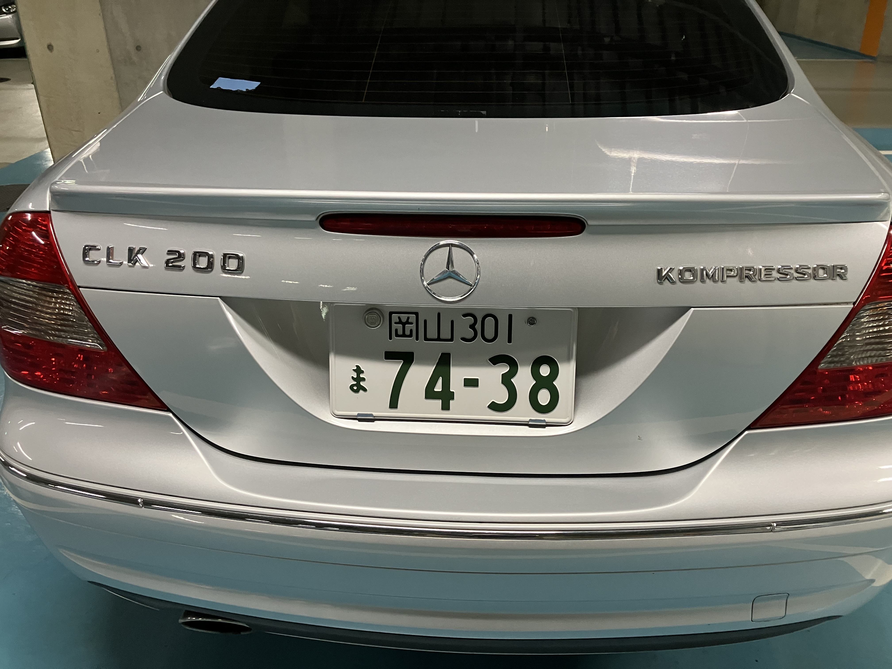

# CLK200 kompressor

SLが6万キロ近い(58500kmほど)なので「もう乗るな」ということで、車屋にSLを預け、代車を借りました。CLK200 KOMPRESSOR。

1.8Lのスーパーチャージャーですけど、昔乗っていた、SLK230 kompressorとほぼ同じエンジンと思われる。おおむね150馬力ぐらいは出ている感じ。悪くないです。ただし、メルセデスの4気筒らしく「ブモモー」と耕運機みたいな音がします ^^;

いまGT43とかも4気筒だけど、今の4気筒は「ぶももー」っていわないんだろうか? GT43みたいな高い車で耕運機の音がしたら憤死するけど ^^;
