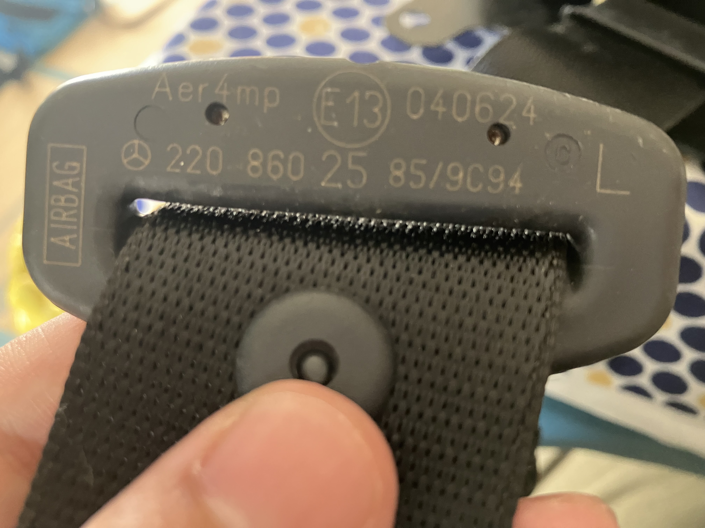

# シートベルト

S55なんですが、「プレセーフテイシ」というエラーが出てて車検に通らないらしい。
車を買った車屋は「修理のための部品はありますから」と言ってたんだけど、
工場で見てもらったら右前シートベルトのキャッチの方。必要なのは左前のシートベルト側。
「なんじゃこりゃ」の状態 ^^;

私の理解では「プレセーフ」っていうのは、衝突時にエアバッグ展開に備えて、
シートベルトを締める機構のことらしい。

それはいいんだけど部品が17万円。それもいいんだけど、製造停止で国内では手に入らない。
それもいいんだけど、エアバッグやシートベルトといった安全部品は、
解体屋が部品を売らないらしい。どうする? ^^;

しかたないのでヤフオクとeBayで漁りました。ふつうに売ってるのよね。
ちなみに海外通販なら新品もあります。送料込みで17万円ぐらいするけどね...

パーツナンバー A220 860 25 85です。これでやっと車検が受けられそう〜、たのしみー ^^;
