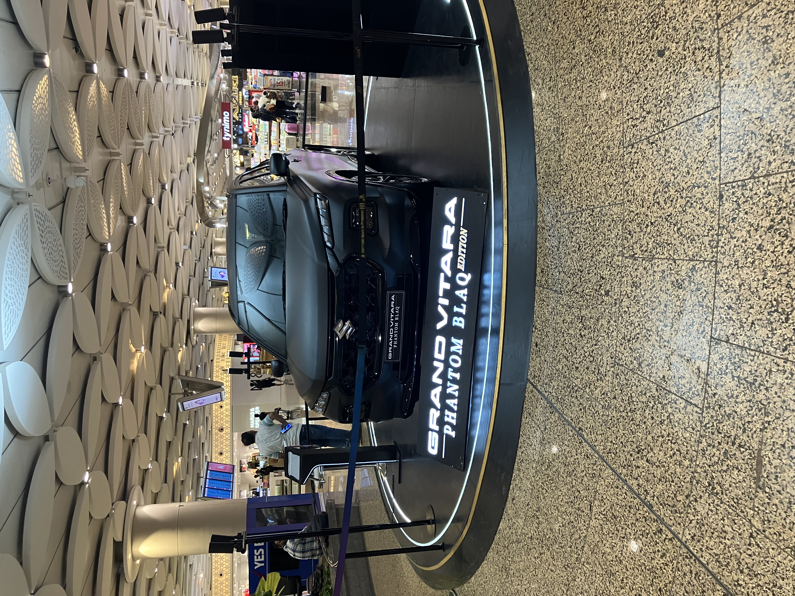
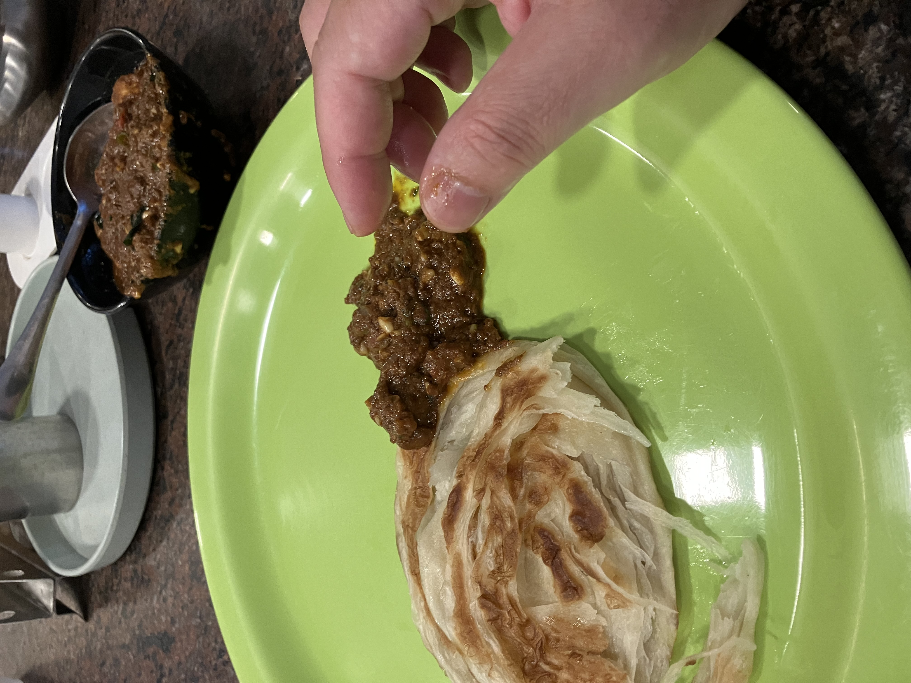
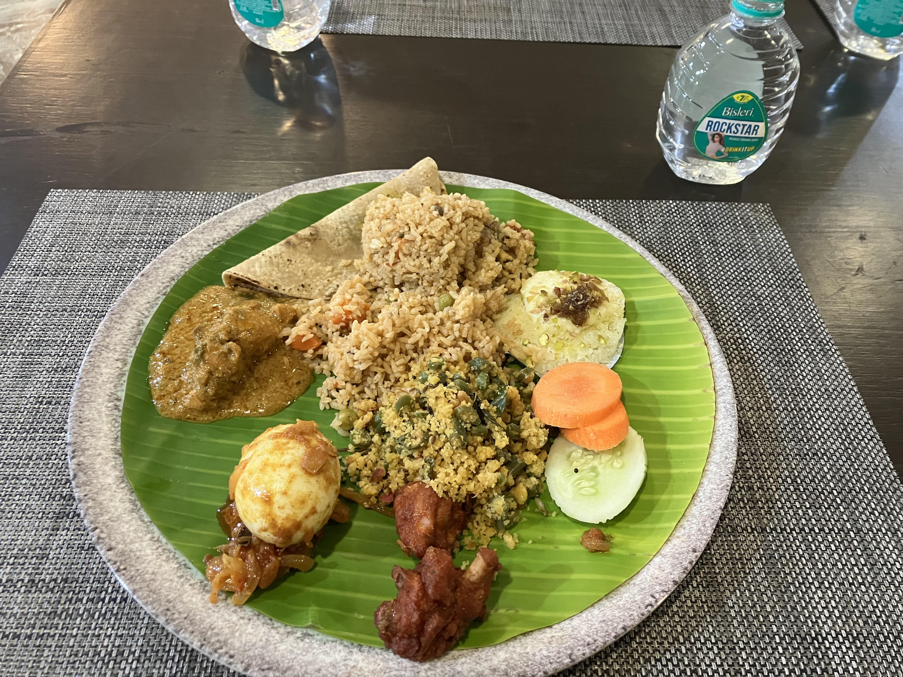
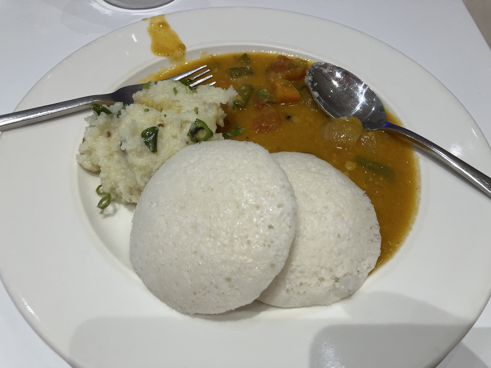
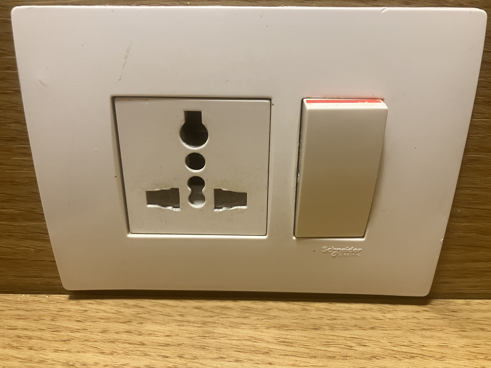
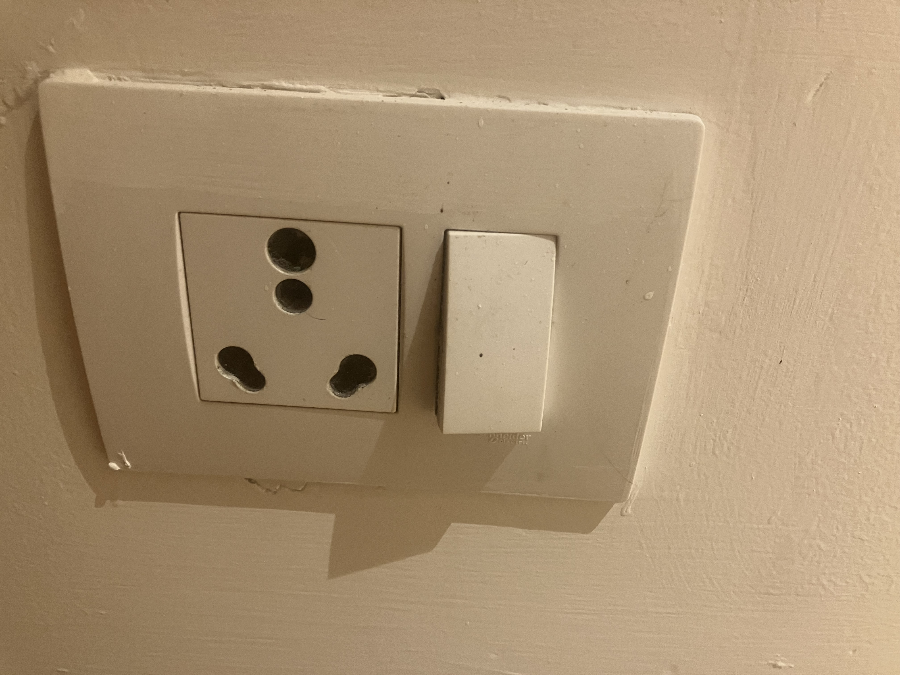

# インド

国際学会に参加のため、インドタミールナドゥ州コーヤンブットゥールに行ってきました。現地ホテル3泊、機中泊往復で2泊の合計5泊6日。54歳が組んでいい日程ではない ^^;

インドまで来るとスズキもカッコイイんだよ。

ホテルに着いて散歩してみたけど、道が悪くてとても歩きにくい。バンコクの歩道も整備わるいけど、
その比ではない。そんななか、ワンちゃんが寝てました。

友達と会って、カフェで初めて手づかみで食いました。

機中泊でろくに寝てないので、早めに寝ました。翌日の会議はこんな感じ。国際会議というか、
学生さんの研究発表会みたいな感じでした。うむ。

ランチ付きだったので食べました。手づかみです。

夕方、バンケットがあったようで、whatsappで召集がかかっていたのですが、
気が付かずにホテルに帰ってしまった。失点1。よく寝て次の日の朝、ホテルの朝食。
白いのはイドゥリといって、南インドの食べ物らしい。おいしい。
タイ人のくせがでて、ついフォークとスプーンを使ってしまう。

その後、いろいろあったのですが省略して、ホテルの部屋のコンセントなんですが、
ひとつの部屋に、こんないろんなコンセントがある国は初めてみました。

心配してたけどひとつも下痢しなかったし、インド人はいい奴らばっかりだし、
インドは良かったです。また行きたいね。