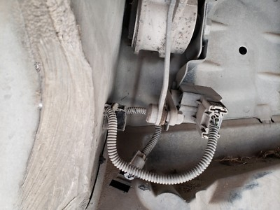

# ABC ウォーニング

2025.12.25 

プーリーの修理は終わって、車は帰ってきました。
なんとなくだけど、速くなった気がする。スーパーチャージャーのベルトのアイドラプーリーがおかしかったので、
たぶん、抵抗になってて、スーパーチャージャーの効きが悪かったんだとおもう。
速すぎて、怖くて全開にはできない。アクセル半分ぐらいで40km/hから秒で130km/hまで行きます ^^;
まあ500馬力もある車を全開で走らせることはないような気もする。

ところが。

ABCのエラーは相変わらずついたり消えたりです。
しかたないのでChatGPTに聞いたところ ^^;

「ABCストロークセンサー（車高センサー）のカプラー接触不良が疑われるから、抜き差ししろ」

ほんとかよー ^^;

場所はここだそうです。前後左右4つあるらしい。

年明けに工場でやってもらおう ^^;