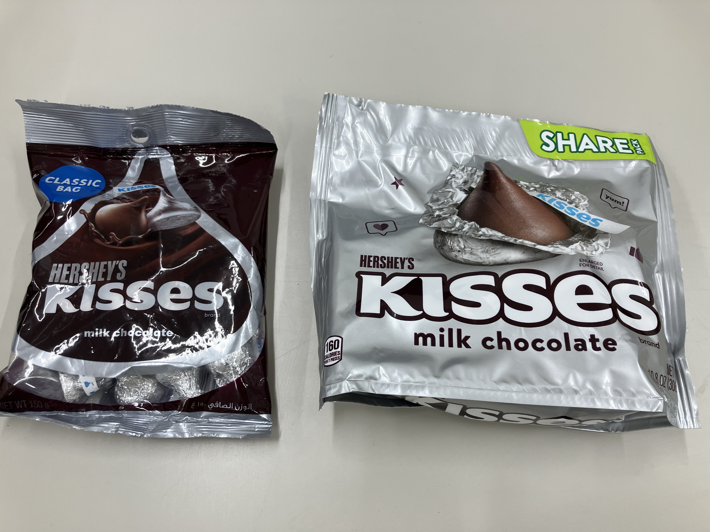
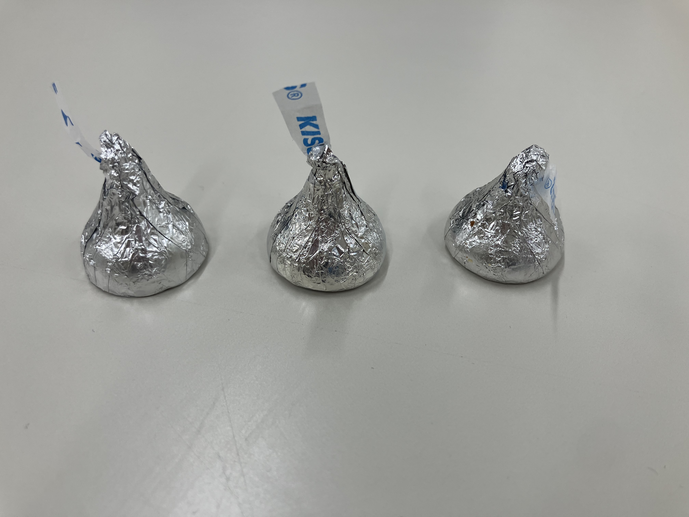
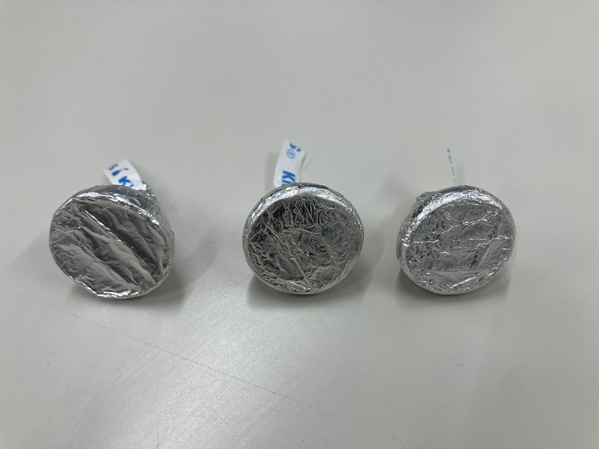
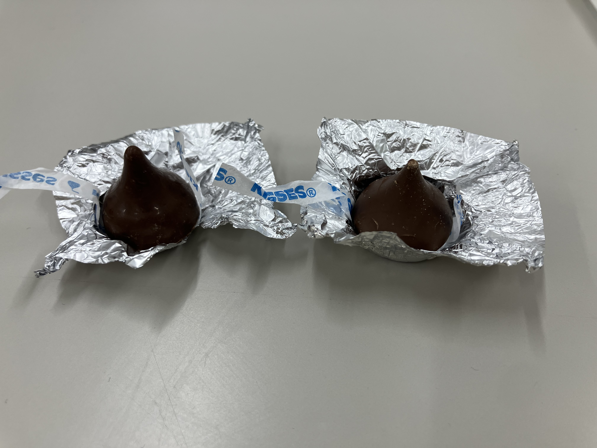

# チョコレート

だいたい毎日チョコレートを食べてるんですが、安くてうまいのがいいなと思って、
10年ぐらいハーシーズキスチョコをたべてるんですよ。こういう1.5kg入りの大袋が
昔は安くて(2500円ぐらい)...国内のコストコの転売だったとおもうんですね。

コストコが扱わなくなったのか、アメリカからの直送に切り替わって、
徐々に値上がりして、6000円+送料1000円とかになっちゃって、
それなら国内で買ってもあまり値段変わらないか安いね、ってなって、
ジュピターとかで買ってきたんですよ。

よくみたら、左がマレーシア産、右がアメリカ産で、じつは形状が違う。

マレーシア産がまずいわけではないんだけど、アメリカ製のと、テクスチャも、味もちがうので、
何となく落ち着かない。買うなら右バッグのアメリカ製なんだけど、300gで1200円。1.5kgで
6000円。うーん、ヨーロッパ製の違うチョコに切り替えようかなあ...VALRHONAとか?

...とおもってたら、アマゾンでハーシーが安くなっているのを発見!

4290円 (送料なし)なら買いですね...2つ買いました ^^;