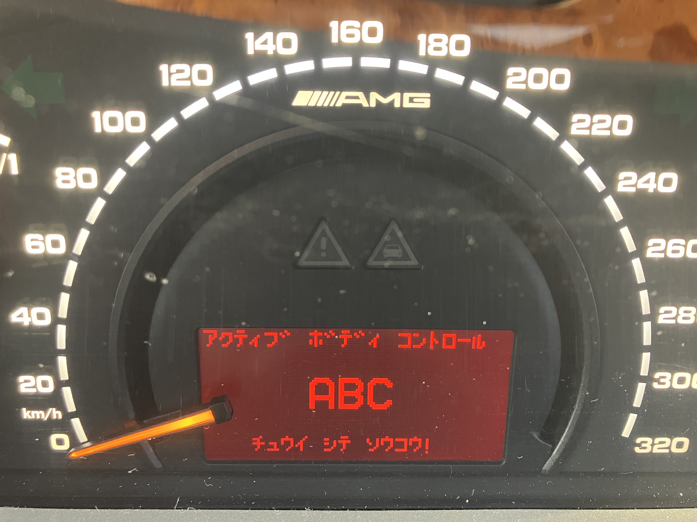
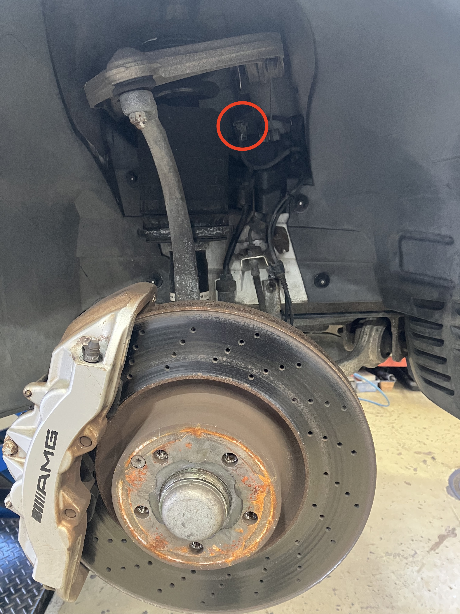
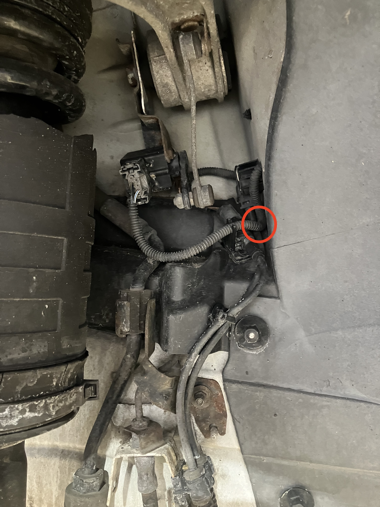
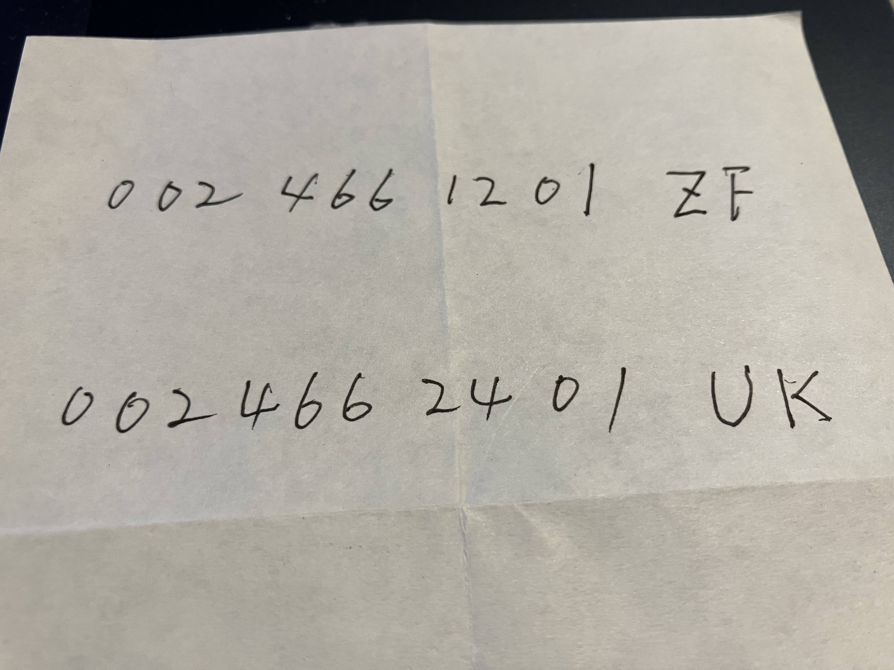
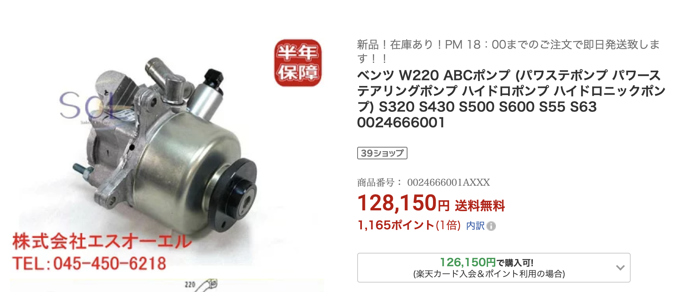

# ABC ワーニングつづき

あいかわらず、「ABCチュウイシテソウコウ」が出たり消えたりします。

赤くて怖いよ...

それで、ChatGPTが「ストロークセンサーのカプラーを抜き差しせよ」とのたまうので、
昨日、工場に行ってきました。ここなんですけどね。右フロントのタイヤを外した様子。

赤丸がセンサーとカプラーです。工場長にカプラーの抜き差しをやってもらったけど、
あまり変わらないですね...
するとChatGPT様、今度は「配線の曲がりがきついので断線が怪しい」とか言い出しまして。
ここですね。

「そこんところいじってみよ」っていわれても、奥の方すぎて、タイヤいっぱいに切っても
手が入らん。ジャッキアップしてタイヤ外さないと...(めんどくさい ^^;)

それで、今日も工場に行ったので、工場長に切々と訴えたところ、テスターをつないで数値見たり、
ABCオイルのリザーバタンクにエアを吹いたりして、結論:「たぶんどこかでエアを噛んで油圧が
出ていないのが原因で、たぶん、バルブ(4本のサスに合計4つ)、バルブブロック(前後に2つ)、
ポンプ(1個)のぜんぶが悪いけど、まずはポンプを交換して様子見かなあ?」ということで、
ポンプの部品番号をもらってきました。

なんかすごく安いけど、合ってるのかなあ...

なんとなくだけどこっちじゃない? 値段的に。

工場長に電話して確認しよ... ^^;
そんで、工場からの帰りは「白いワーニング」でした。「いまはエラー出てないけど、履歴があるよ」
っていうことらしいです。

このままだといいんですけどねえ〜 ^^;
ちなみに「トランク開かない」(鍵を使えば開く) 問題もあります ^^;