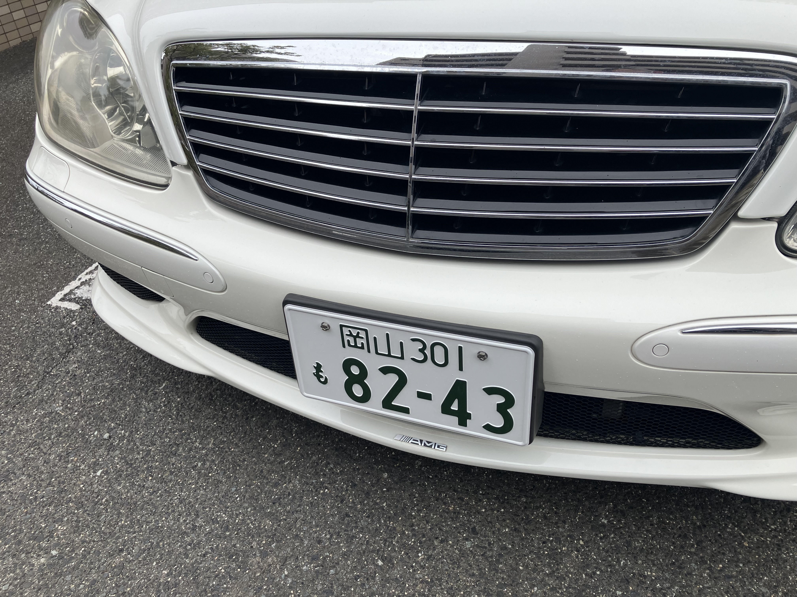

# AMG バッジ

AMGのバッジがフロントについてるんですよ。ここ。

わかりますかね? アップにするとここ。

工場の社長に「これじぶんでつけたん?」って笑われまして ^^;
最初からついてたんですよー。でも、工場にいる平行輸入の本国仕様には
ついてないんですよね。前の持ち主がつけたのか?

というわけで、カーセンサーで調査してみました。

2000年。ついている。

2003年。ついている。

2004年。ついている。

2004年。ついていない。

どうやら日本仕様には「ついている」が正解っぽい。
外そうと思ったけど、つけたままにしておくか... ^^;