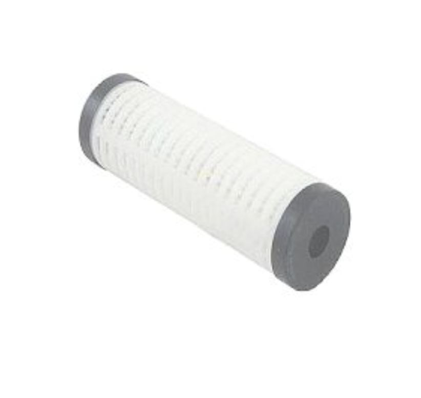
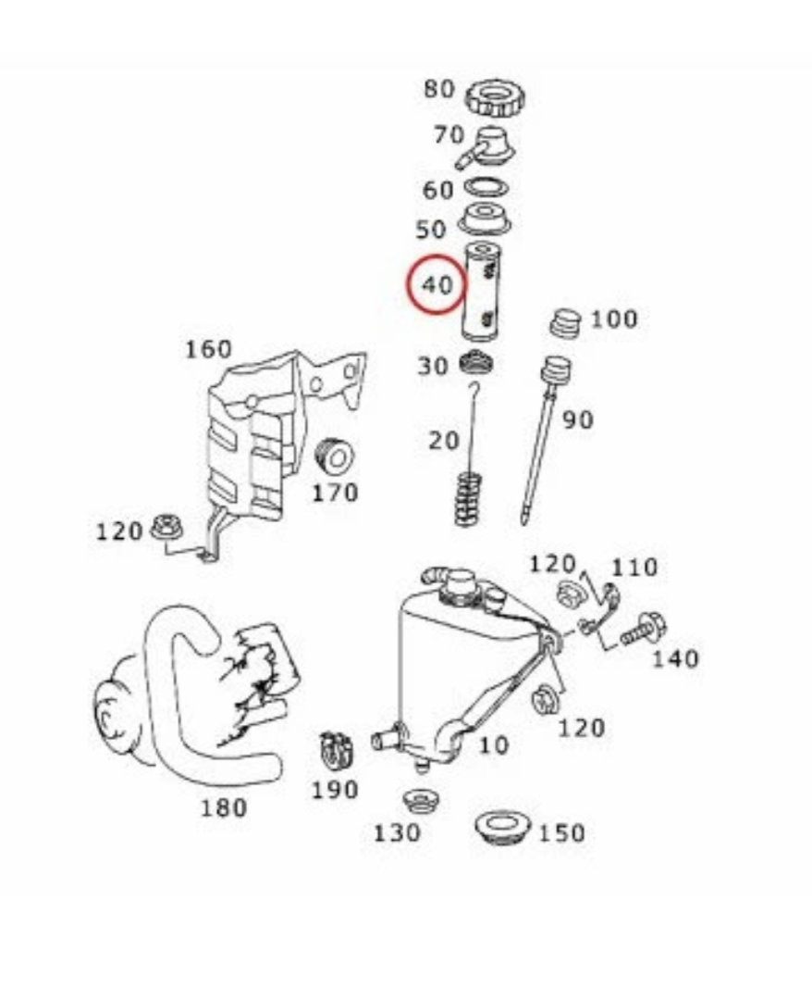

# ABCフィルタ

ABCのポンプが超高いので、リビルドなり、交換なりは最後の手段にして、
まずはABCのフルードとフィルタを交換して様子を見ます。
フィルタはこんな感じ。

エンジンオイルフィルタと似てる。場所はここ。リザーバタンクのところにあるみたいね。

というわけで車は工場においてきました。どうなりますか!
リザーバタンクからポンプに行くところのサクションパイプもあやしいかなと
おもったんだけど、工場長「それは関係ない」とのことで、一旦、フルードと
フィルタの交換で行きます!

ちなみに、今朝からボンネットが開きません。運転席側のラッチが噛んだままです! そのまま工場においてきた! どうなる! ^^;