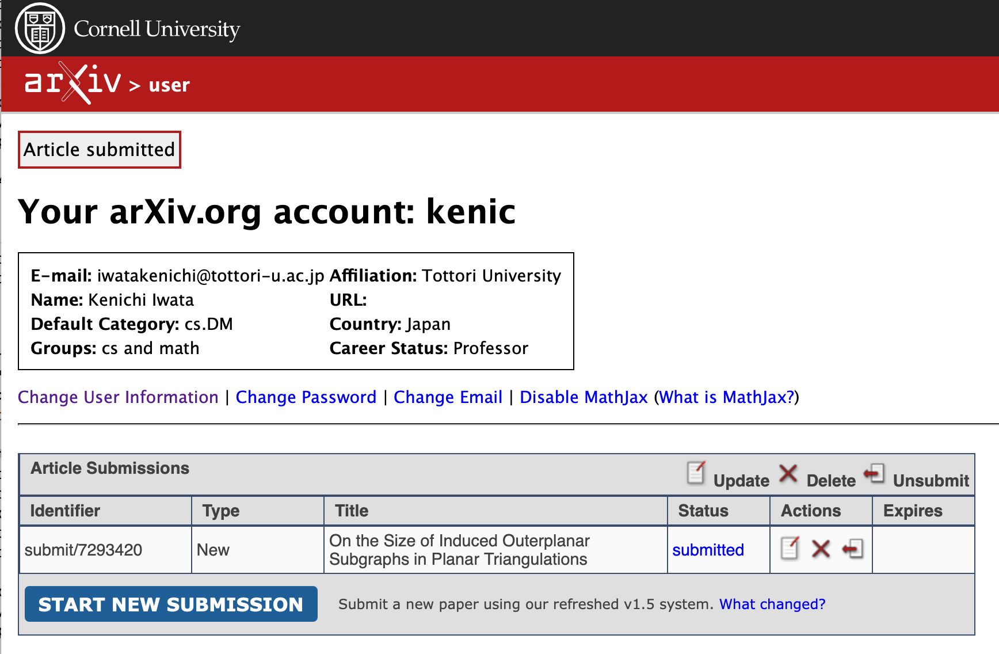

# arXiv

[arXiv](https://arxiv.org)に論文を投げようとしてるんですが、たしか12月の末か、1月の初め頃に試した時は問題なかったのに、「誰かにエンドース(推薦?)してもらわないと投稿できないよ」との表示がでました。どうやら、以前からエンドースが必要なしくみだったんだけど、edu とか ac.jp とかのメールアドレスからだと免除になっていたのが、1月から変更になって、ac.jp でもエンドースが必要になったらしい。そうなんだ。

「だれかにエンドースもらってね」っていう画面はキャプチャーし忘れました ^^;

誰でもいいから頼んでエンドースしてもらえ、と書いてあるんですが、似たトピックで論文を投稿していらっしゃる日本の先生をみつけて、メールでお願いしました。

メールでお願いしたのが夜中で、朝、無事エンドースしてもらえまして、論文を投げました。パチパチ。

特に問題なければ、表示されるまでに2日か3日ぐらいらしいです。