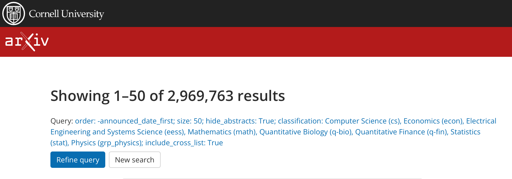
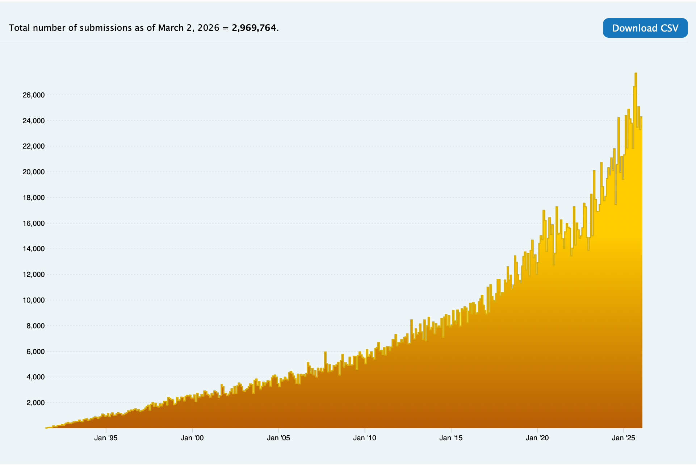

# arXiv Declined

arXivに初めて論文を投げたんですが(このブログの記事:[arXiv](https://kenic.github.io/2026/0224arxiv/))。

> In this case, our moderators have determined that your submission would benefit from additional review and revision that is outside of the services we provide. 

「コンベンショナルペーパーでレビューしてもらった方がいいよ」とかいって、載せてもらえない! なんだってー! ^^; プレプリントサーバじゃなかったの? ^^;

参考文献[1]によると2025年末現在、arXiv全体の10％程度がリジェクトされるらしいが、公式から統計は公開されていない(ふつうまともなジャーナルだとアクセプト率は公開される。低い方が「まとも」なジャーナルのシグナルになる)。月間サブミッション数はおおむね20000本らしい(この数字は[公開](https://arxiv.org/show_monthly_submissions))。もともとcsカテゴリは投稿が多くてモデレータが苦しいらしく、csカテゴリに限ると、たぶんもっとアクセプト率は低いんでしょうね。

それで「リジェクト率」を知りたくて色々調べたんだが、上記の「月間サブミッション数」は採録された数っぽいね。検索結果と付き合わせると数字がだいたい合致するので。「採録された数」はわかるが、「投稿された数」はわからない。

arXivで全期間全カテゴリ重複なしで検索するとこう。母数は2,969,763本。

上記の統計のページだとこう。母数は2,969,764本。

twitterで検索してみると「arXivにリジェクトくらった」みたいな話が、ポロポロと発見できる。そんなに珍しい話でもないし、ここ最近に限った出来事でもないということもわかる。

しかたない、arXiv は読む専にして、[Zenodo](https://zenodo.org)に投げるか... ^^;

## 参考文献
[1][Preprint site arXiv is banning computer-science reviews: here’s why](https://www.nature.com/articles/d41586-025-03664-7), Davide Castelvecchi, [www.nature.com](https://www.nature.com), November 2025.