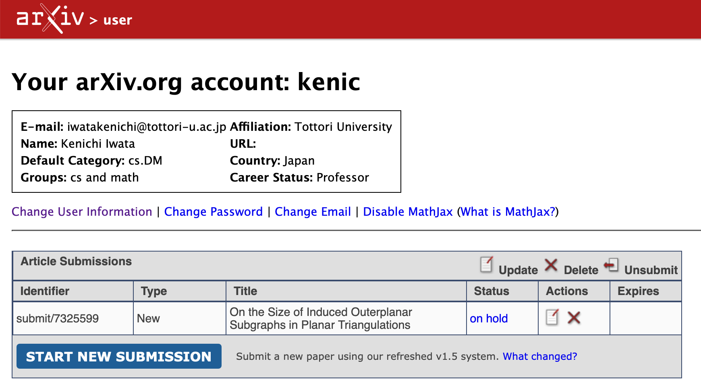
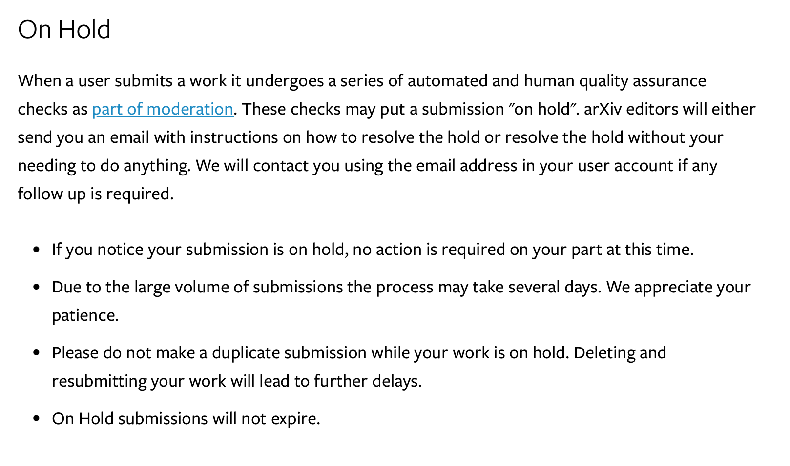

# on hold

私、こう見えてけっこうしつこいので ^^; 論文をリバイズして (追加実験を行って)
arXivに投げ直しました。すると。

ステータスが「Submitted」じゃなくて「on hold」になってる! ^^;
解説しよう! 「on hold」とは?

【日本語訳】
ユーザーが作品を投稿すると、モデレーションの一環として、自動チェックと人による品質確認の一連の審査を受けます。これらのチェックにより、投稿が「保留（on hold）」になることがあります。arXivの編集者は、保留を解消するための手順をメールでお知らせするか、あなたが何もしなくても保留を解消します。追加の対応が必要な場合は、ユーザーアカウントに登録されているメールアドレス宛に連絡します。

*投稿が保留になっているのに気づいても、現時点ではあなたが行うべき作業はありません。
*投稿数が多いため、処理に数日かかる場合があります。ご理解とご協力をお願いします。
*保留中に重複投稿はしないでください。投稿を削除して再投稿すると、さらに遅れる原因になります。
*保留中の投稿は期限切れにはなりません。

届いたメールがこちら。

> Dear Kenichi Iwata,
> 
> Thank you for submitting your work to arXiv.
> 
> Your submission has been received and is under consideration. The temporary su bmission number is:
> submit/7325599.
> 
> As with all submissions, this work will go through technical and moderation checks. You will be contacted by arXiv when the work is announced or if any issues are identified.
> 
> Our goal is to screen and announce papers as quickly as possible while ensuring that papers meet long-term archival standards. Generally, this process takes two business days, with announcements occurring at 20:00 ET, Sunday through Thursday.
> 
> You can make changes and view the current status of the submission from your user dashboard: https://arxiv.org/user/.
> 
> Below is a copy of the submission information.
> 
> Regards,
> arXiv Support

Kenichi Iwata 様

arXiv にご投稿いただきありがとうございます。

投稿を受け付け、現在審査中です。仮の投稿番号は以下の通りです：
submit/7325599

他の投稿と同様に、この論文は技術的チェックおよびモデレーション（内容確認）を受けます。論文が公開（アナウンス）された時点、または問題が見つかった場合に、arXiv からご連絡します。

arXiv では、長期的なアーカイブ基準を満たすことを確認しつつ、できるだけ迅速に論文を確認して公開することを目標としています。通常、このプロセスには2営業日ほどかかり、公開のアナウンスは米国東部時間（ET）で日曜から木曜の20:00に行われます。

投稿内容の修正や現在のステータスの確認は、ユーザーダッシュボードから行えます：
https://arxiv.org/user/

以下に投稿情報のコピーを添付します。

よろしくお願いいたします。
arXiv サポート

ま、期待せずに待ちますかね... ^^;

