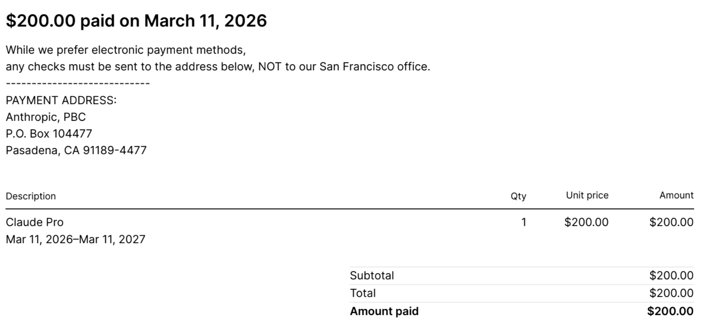

# claude

Claude Codeが使いたくて、Claudeを買ってみました。年間200ドル。4万円ぐらい?

Geminiは大学のWorkSpace for Educationで使っていて、ChatGPTは月3000円のPlusプラン、
Copilotはあんまり使ってないです。軍事協力の件もあってChatGPTはやめようかとも
思っているところ。MacだとけっこうローカルLLMが動くという話も聞かせてもらったところなので、

Gemini (WorkSpace for Education) + ChatGPT (無料) + Claude (Pro) + ローカルLLM

でいいかなともおもったり。ちょっと悩みますね。

