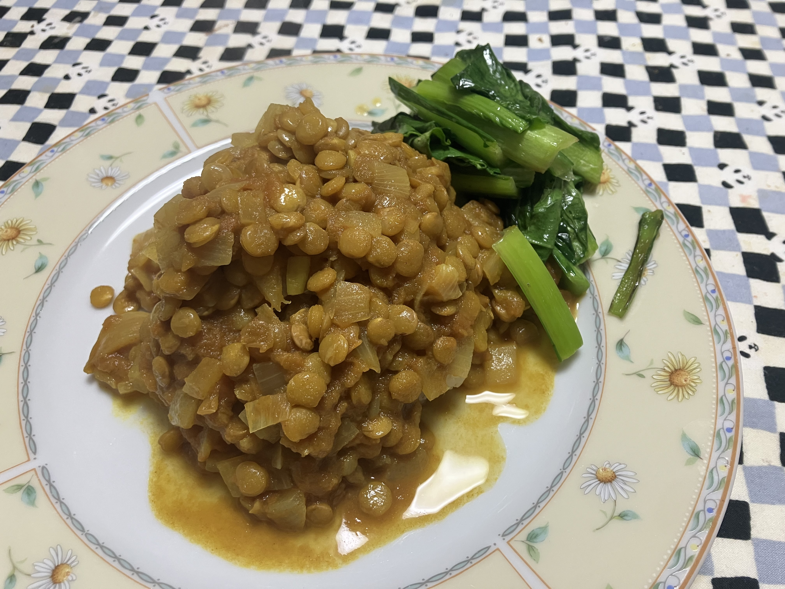

# 自作のダル

立て続けにネパール料理にいったので、ダル (に似たもの) を作りたくなって、作ってみました。

ポイントがいくつかあります。

- ダルは「ひきわりの豆」のことだけど、使った豆はホールのレンズ豆なのでダルではない
- スパイスとかないので、レンズ豆100gに対して「カレーミックス」みたいな粉を大さじ山盛り1つかったら、ちょっとスパイス強すぎた ^^;
- レンズ豆100gに対して小玉ねぎ1個+大トマト1個+水300mlだと汁っぽくなくなった ^^;

次回は
- カレーミックスは小さじ1
- レンズ豆100gに水は500ml

これで行ってみよう!