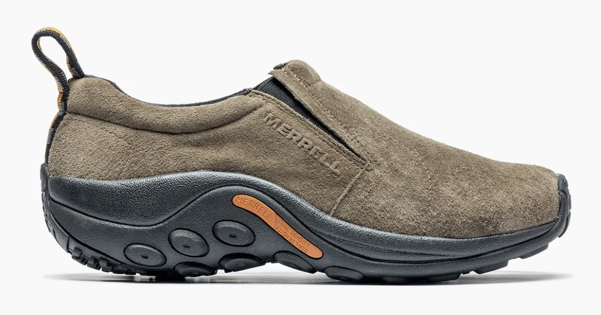
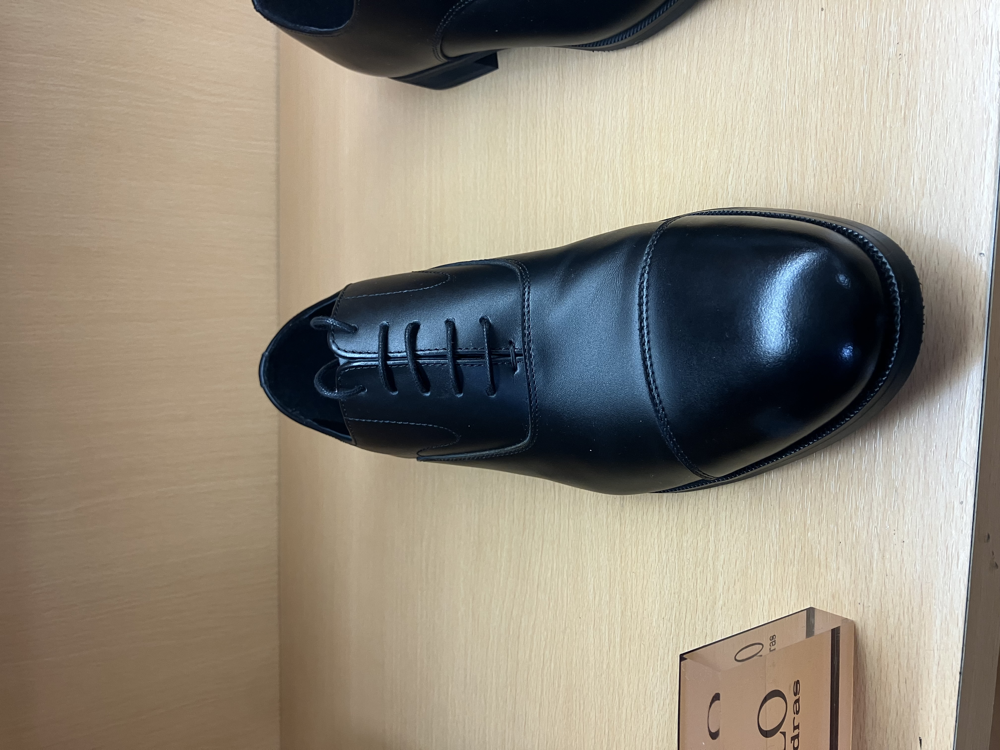
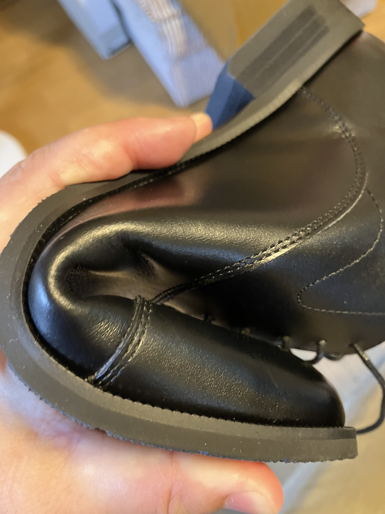

# 革靴

普段はメレルのジャングルモックを履いてるんですね。これはすごい履き心地がいいのでおすすめ。ちょっと見た目はカッコ悪いけど。

給料少ないし、貧乏なのでスーツは勘弁してもらってるんですけど、たまにはスーツを着ないといけないことがある。お葬式とか? 退官記念最終講義&パーティーとか?

昔つくったスーツのおなかがパンパンなのはまあちょっと痩せるとして ^^; 問題は靴だ。まともな革靴は茶靴しか持っていない。これは記憶が正しければ、むかし天満屋で5万円ぐらいで買ったもの。写真はないけど。ところが、たまに茶靴では具合の悪いことがある。お葬式とか? ^^; 1足ぐらい黒い短靴をかうかとおもって、高島屋に行ってみた。これだ。

まともな靴がないとか、あっても10万円みたいな事態を危惧していたのですが、なんとこの物価高のご時世に1.6万円です。助かる〜

うちに帰ってきたらさっそくブレークインです。ぐいっと。もちろん左右とも。

ちょっともったいない気もするけど、これをやらないと、革靴ってとても履けたもんじゃないのよね。
