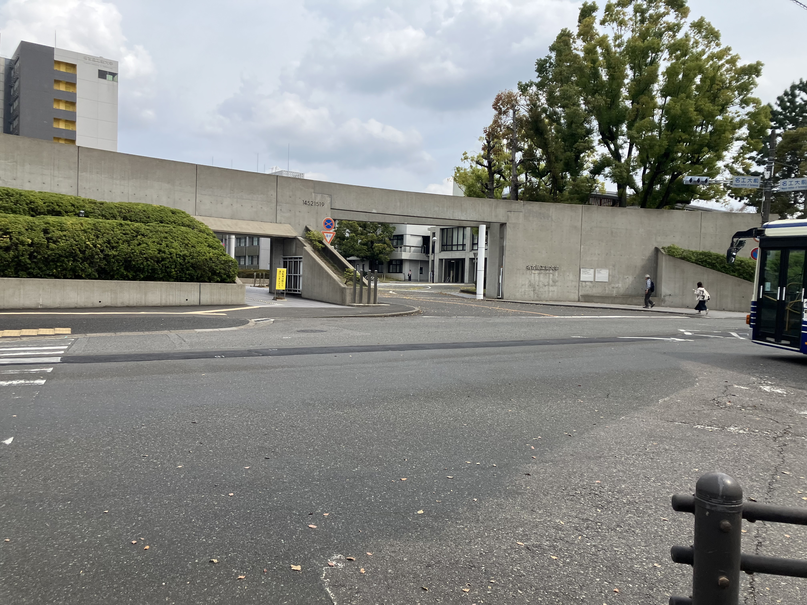
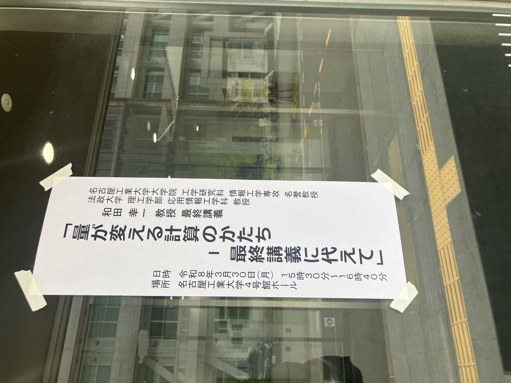

# 和田先生最終講義

昨日、3月30日は名工大に行ってきました。
学部の卒業以来だから約1億年ぶりにきた。いつの間にかモニュメント? みたいなものができている。

生協前にある、登ると留年する古墳も健在です。

学部の卒論の指導教員だった和田先生が定年退職されるので、最終講義です。70歳。

35年ぶりぐらいなのに、ぜんぜんお変わりないんですよ。びっくりしました。懐かしくて涙が出ました ^^;