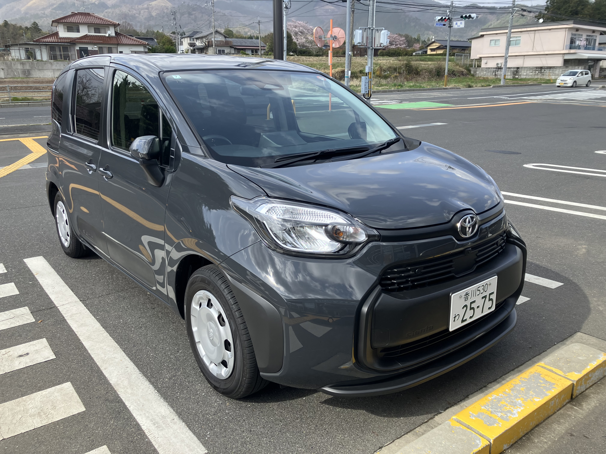

# W220の代車シエンタ

というわけで、W220がドナドナされて行ったので、代車を借りてきました。
ピカピカのシエンタです。走行5000km未満。まったく期待していなかったのですが、
思いのほかいい車でした。ちょっとアンダーパワーだけど1人乗りなら踏めばまあ走るし、
よく曲がるし、安定していて静かだし、小さいのに広いし、ハイブリッドで燃費もいいし、
トヨタすごいね。よく売れている理由がわかりました。感銘を受けた ^^;

