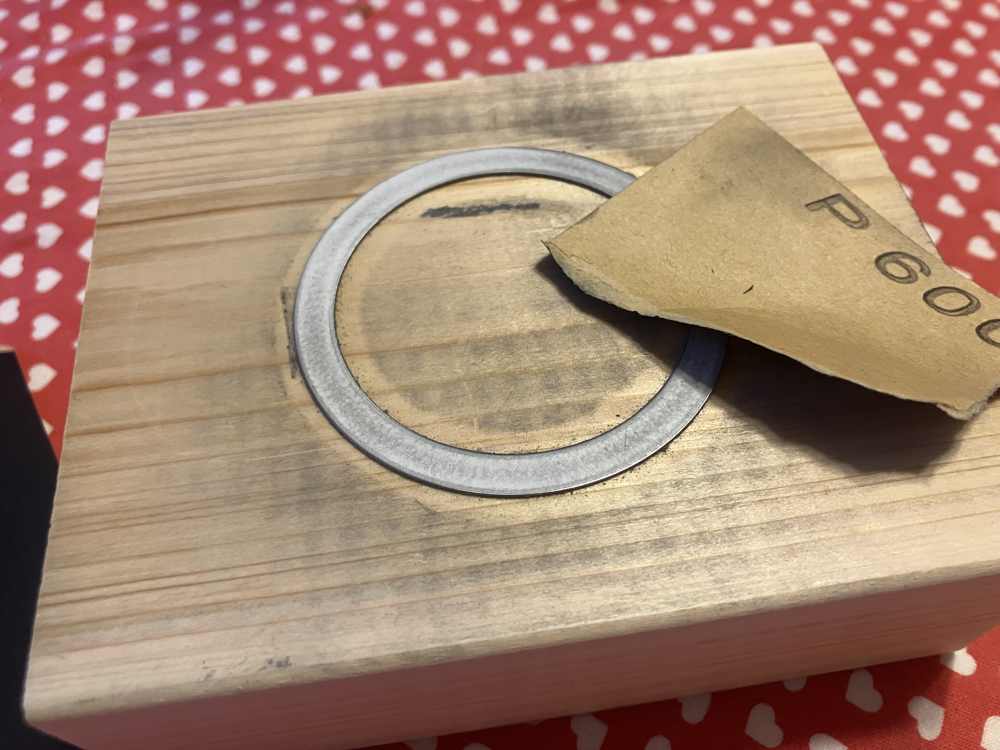

# MagSafeのリング

iPhone SE3 を使っているんですが、いつの頃からかライトニング端子の接続が悪いんですよ。背面から充電もできるんですが、MagSafeになってないので位置決めが厳しい。それで、MagSafeにくっつくようの鉄板のリングが百均にあるのでかってきました。直接iPhoneに貼り付けたんですが、わるくない。わるくないけど、鉄板が1mmぐらいあるので段差が気になる。じゃあ、加工すればいいよねってことで、台になる木と、サンドペーパーを買ってきました。さてどうなるか...

