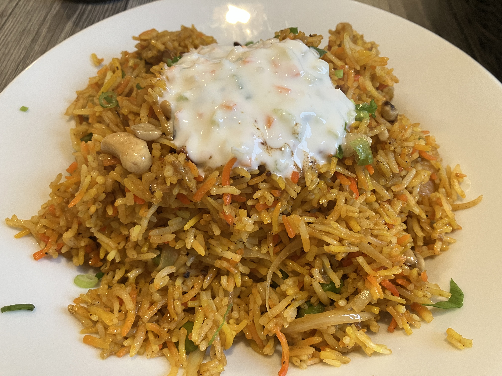
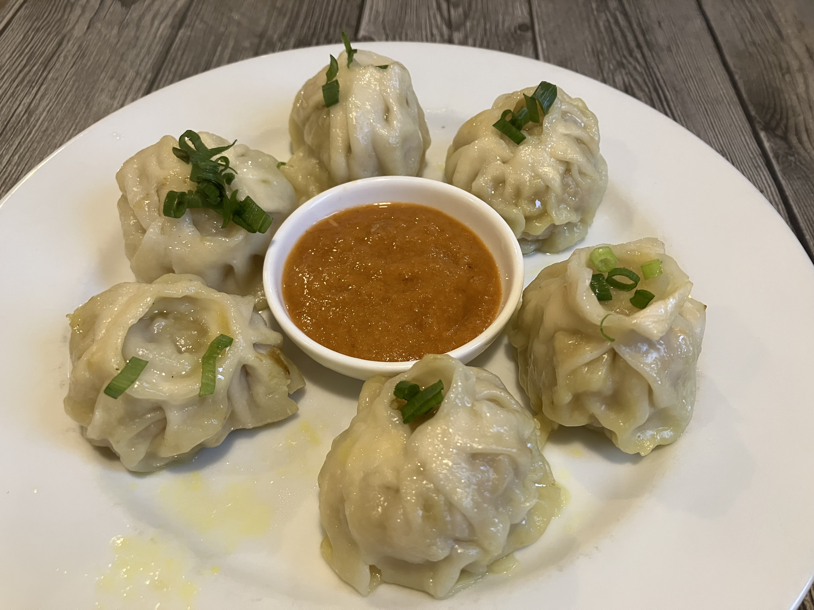

# ビリヤニ

安長のカレー屋に行ったのですが、店員はインド人だと言い張るので、ダルバートチャレンジは失敗。
ネパール人がいるんだったらダルバートがあるかどうか聞こうと思ったんですけどね...
ホールのおじさんは、日本語も英語も怪しい感じでした ^^;
そこで、セカンドチョイスのビリヤニを食べましたが、うまいすね...

ついでにモモも食べました。この店悪くないんだけど、他の類似店より、値段が高いんだよね。だいたい1.5倍ぐらい。次は違う店に行ってみようかな...

