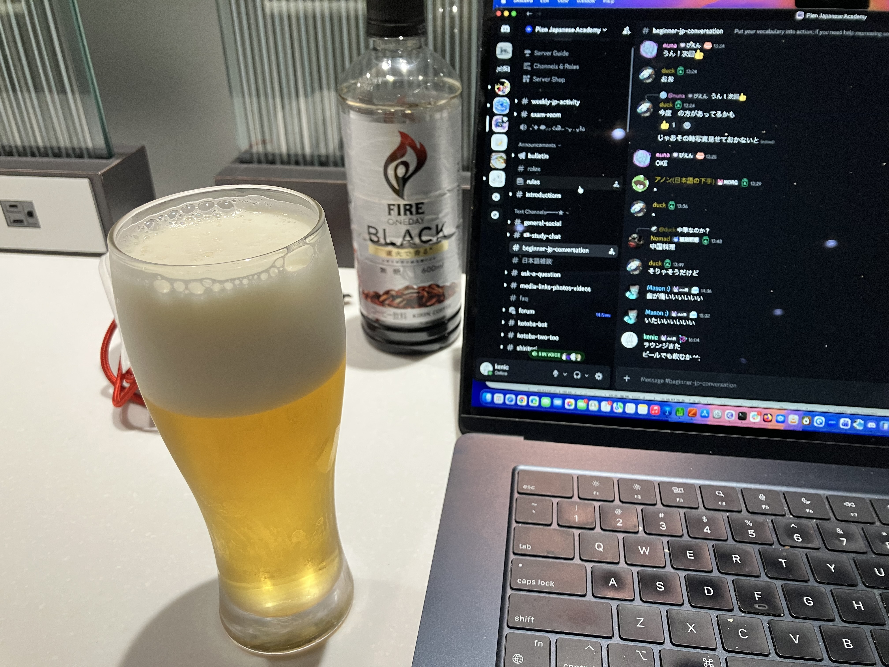

# 航空会社ラウンジ

20年ぐらい前にステータスとって(自腹で)、それからずっとスーパーフライヤーズなんですけど、28年から改悪? されて、SFヒラ会員はカードで300万円以上決済しないとスタアラシルバーになっちゃうらしい。300万円も行けるかなあ... 利用額のカウントは26年の12月からだそうです。もうすぐ!

詳しい記事は[ここ](https://www.ana.co.jp/ja/jp/amc/premium/sfc/update2026/)。

というわけで、とりあえずきょうもラウンジでおびいるをば ^^;

