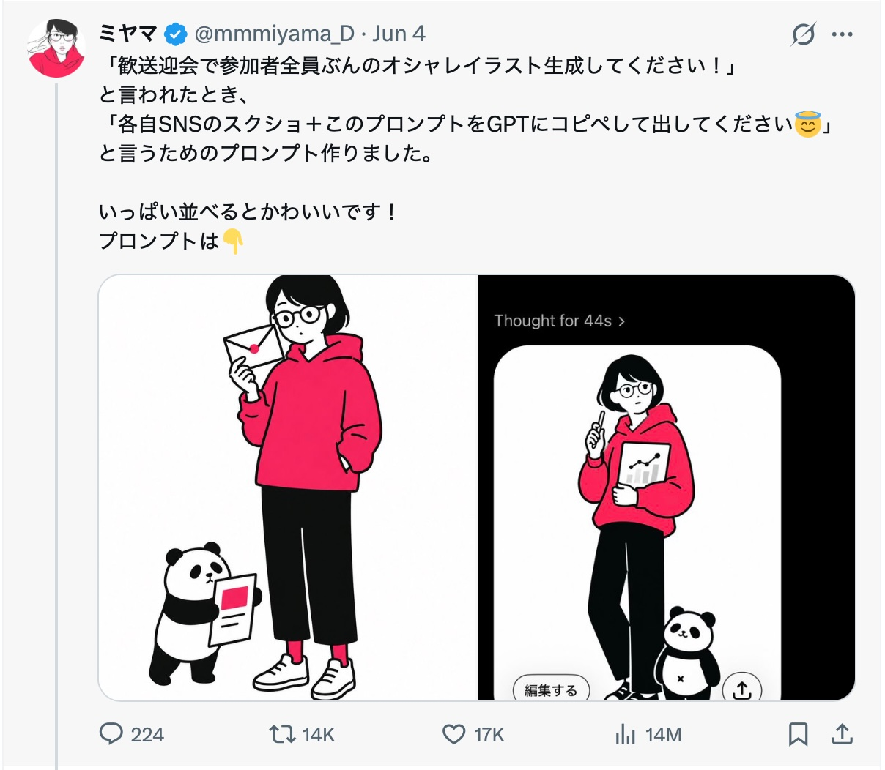
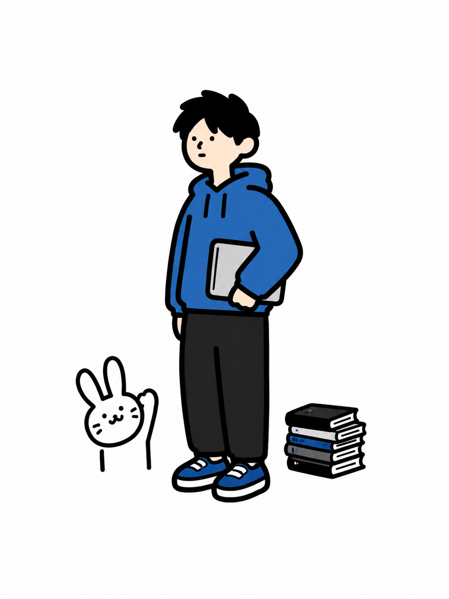

# 自己紹介画像

なんかこういうのがはやって? いるらしいです。



プロンプトはこう。

```
アップロードされたSNSプロフィール画面の雰囲気、配色、アイコン、ヘッダー画像、プロフィール文、投稿テーマ、余白感、語り口、世界観を総合的に読み取り、その人物またはブランドの印象を象徴するシンプルなイラストを生成してください。

目的は、SNS上で一瞬目に止まり、プロフィールの世界観が直感的に伝わる、フックのあるエディトリアルデザイン性の高いイラストにすることです。

構図は3:4の縦型。
斜め45度正面アングルを基本に、中央に全身またはほぼ全身の人物を1人配置してください。
人物のまわりには、そのSNSアカウントらしさを象徴する特徴的なオブジェクトを1〜2個だけ配置してください。
オブジェクトは、職業・発信テーマ・価値観・雰囲気・口調・ビジュアルトーンから連想されるものにしてください。
ただし、情報を詰め込みすぎず、象徴的で少し意外性のあるモチーフにしてください。

イラストスタイルは、ミニマルでシンプルなフラットカラーのコミック風。
主線はすべて**黒の極太ライン**にしてください。
線はラフすぎず、均一でクリーンな手描き風にしてください。
細い線、繊細な線、薄い線は使わないでください。

人物は基本的な図形に単純化してください。
顔の特徴は最小限にし、点の目、シンプルな鼻、小さな口で表現してください。
プロポーションは少しぎこちなく、完璧すぎない親しみを持たせてください。
ポーズは大げさにせず、静かに立つ、少し観察している、何かを持っている、少し間の抜けた状況にいる程度にしてください。

色はプロフィール画面から抽出した印象的な色を参考にし、2〜4色程度のソリッドなフラットカラーに制限してください。
背景は描かず、白または無地の余白を大きく残してください。
シェーディング、グラデーション、リアルな質感、細かい描き込み、写真風表現は使わないでください。

全体の印象は、洗練されたSNSアイキャッチ、現代的な日本のカルチャー誌の挿絵、少しクセのあるエディトリアルイラストの中間にしてください。
かわいすぎず、広告っぽすぎず、情報商材っぽくせず、静かだけれど記憶に残るビジュアルにしてください。

文字は入れないでください。
ロゴ、UI、SNS名、プロフィール文、投稿文などの文字情報は描き込まないでください。
ただし、文字情報から読み取れる印象や世界観は、人物の雰囲気・服装・小物・配色・構図に変換してください。

余白を広く取り、1枚のアイコン的な強さと、雑誌の挿絵のような編集感を両立してください。
完成画像は3:4。
```

わたしのtwitterのプロファイルのスクショでつくったのがこれ。



とりまカワイイwww