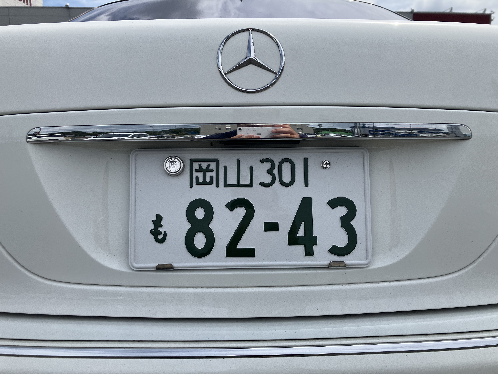
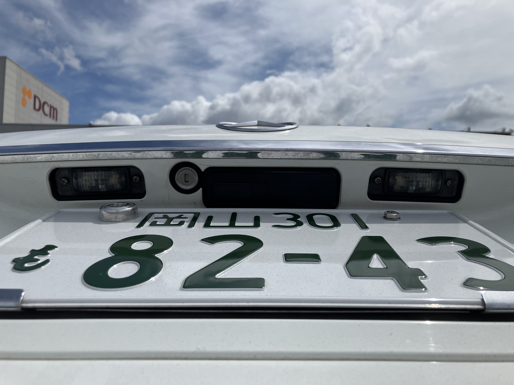
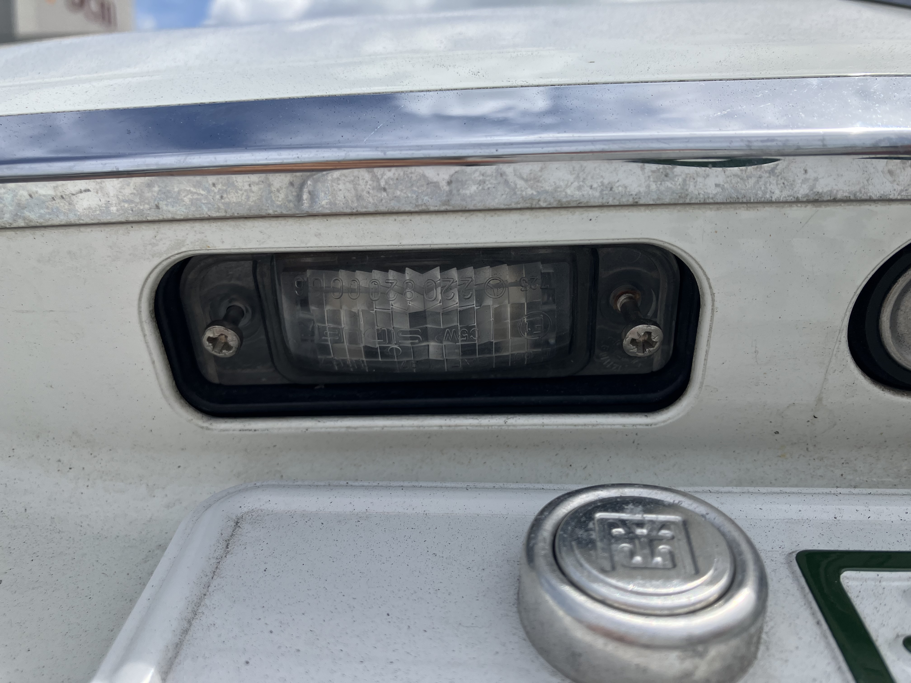
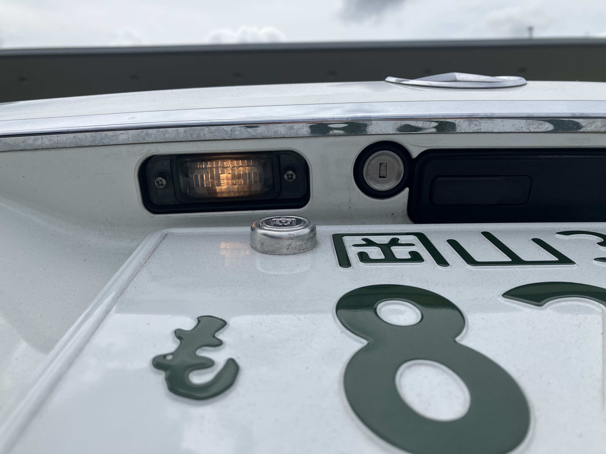

# ライセンスプレートのライト

走行中、トンネルに入っタイミングで「ライセンスプレートの左ランプがついてないから点検せよ」みたいなエラーが出ました。止まった時にみてみると確かについていない。まあ、球切れかな。交換します。

ナンバープレート灯はここです。

ここね。普通に左右二つある。左が切れている。

こっちが左だ。

プラスネジ2本で止まっていて、外すのは簡単。ところが、ライト本体が外れない。
コンコンと叩いたり、ゆすったりしたが、ヘラを差し込んだり、
あまり無理すると割れそうなのでギブアップ ^^;

ギブアップしたあと、確認すると点灯!! なんか接触が悪かっただけか... ^^;
外したネジが硬くて締められなかったので、それもギブアップしました...
チャック付きの袋にいれておいて、あとで工場長に締めてもらおう... ^^;
