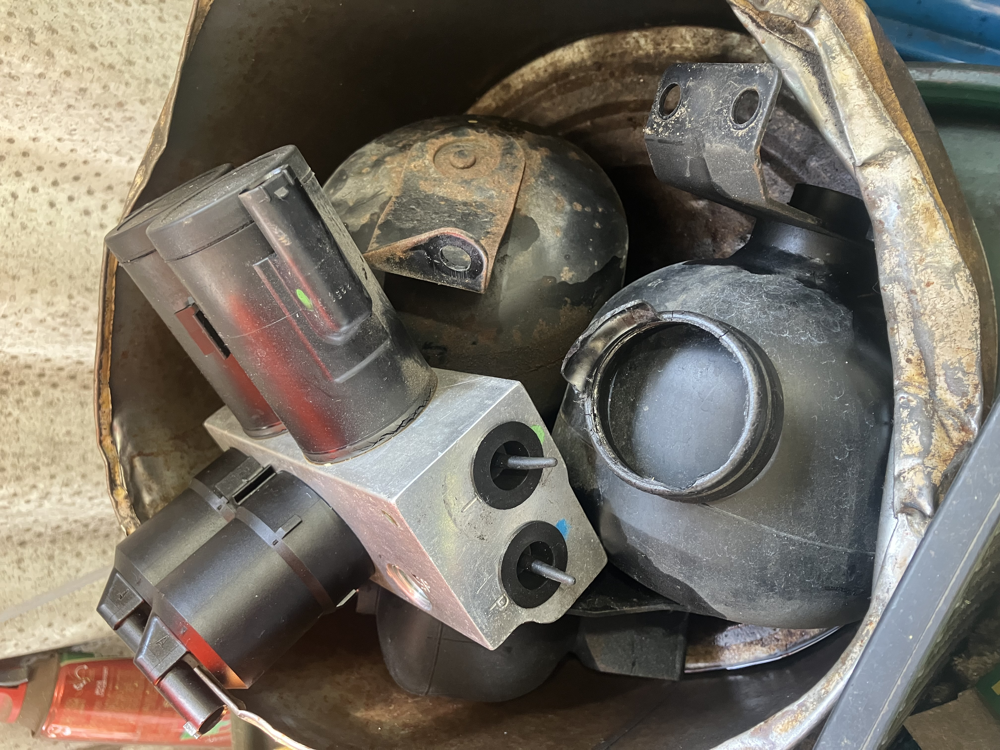
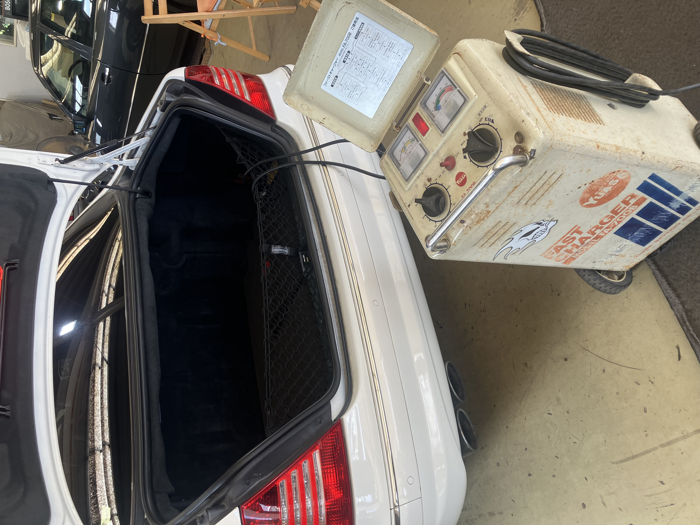
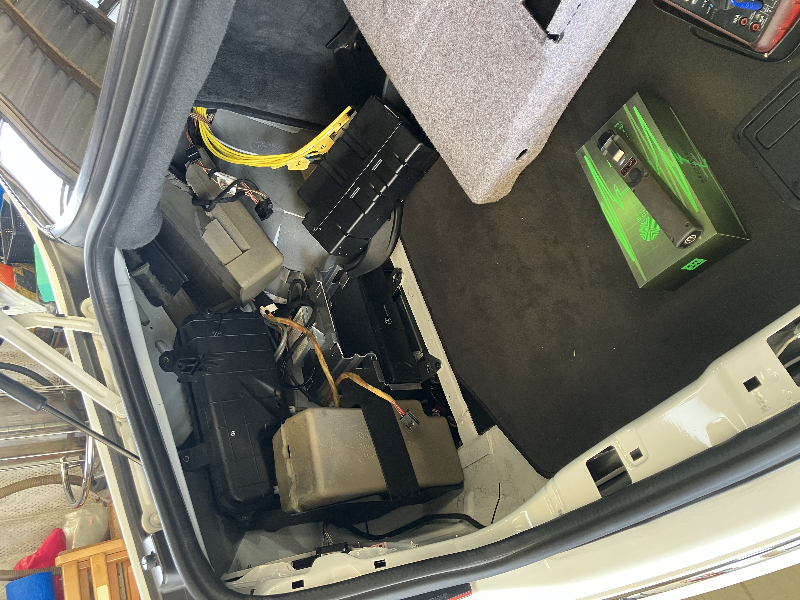

# リアバルブブロック他交換

S55を工場に預けて2週間、バルブブロック等の交換が終わりました。
交換された部品。バルブブロックと、アキュムレータ3個。あと、120km/hこえると
「バババ」音の出る原因になってたやつの切れ端。

バルブブロックはもらって帰ってきました。新品は30万円超で、今回、10万円の中古部品に
つけかえたのですが、さらに壊れたらこいつを油圧屋さんで修理してもらって戻す予定。

それで楽しく乗って帰ってこようとしたのですが!!

バッテリーが上がってる! どっかから放電してるっぽい。この間まで大丈夫だったのに...

社長「昨日まで大丈夫だったのに急にダメになるのが機械というもの」

はいおっしゃるとおり ^^;

工場長が切り分けしてくれているので、置いて帰ってきました ^^;
直るといいんですけどねー
