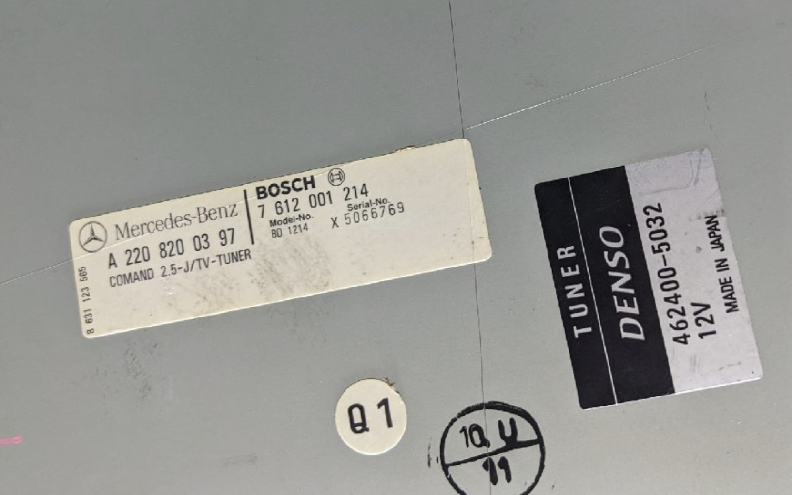

# 準備

W220 S55 後期を持っているのですが、純正ナビが古いんですよ。あたりまえですけど。
かといって、社外品に買えるのももったいないし、見た目がカッコ悪くなるので、
純正のまま使っています。

色々試したのですが、純正のナビはPanasonicの大古のナビなのであきらめて、
純正の液晶画面に吸盤をくっつけて、マグセーフでiPhoneをくっつけてナビの代用しています。
これはわるくないです。

ここでつかう「吸盤マウンタ」と「iPhoneを取り付けた様子」はあとで追記します。

ところが問題なのは、音声です。音楽を聞きたいのですが、R230あたりとちがって、
W220の純正ナビは外部入力端子がないんですね。しかたがないので(なつかしの ^^;)
FMチューナーを使っています。USBドングルタイプのをつかっていて、カッコは悪くないのですが、
音がひどい。外からのラジオの電波に負けるし、ノイズもひどい。困る。
なんとかしたい。

色々考えたのですが、純正ナビにTVがついています。これはアナログTVで、いまや無用の長物です。
この音声回路に割り込ませる or スイッチできれば、TV経由で音が出せます。

というわけで、とりあえず、回路がどうなっているのか、
解析用にTVチューナーをヤフオクで買いました。

A 220 820 03 97は、W220の全モデルで共通のTVチューナーっぽいです。
とりあえず、届くのが楽しみです ^^;