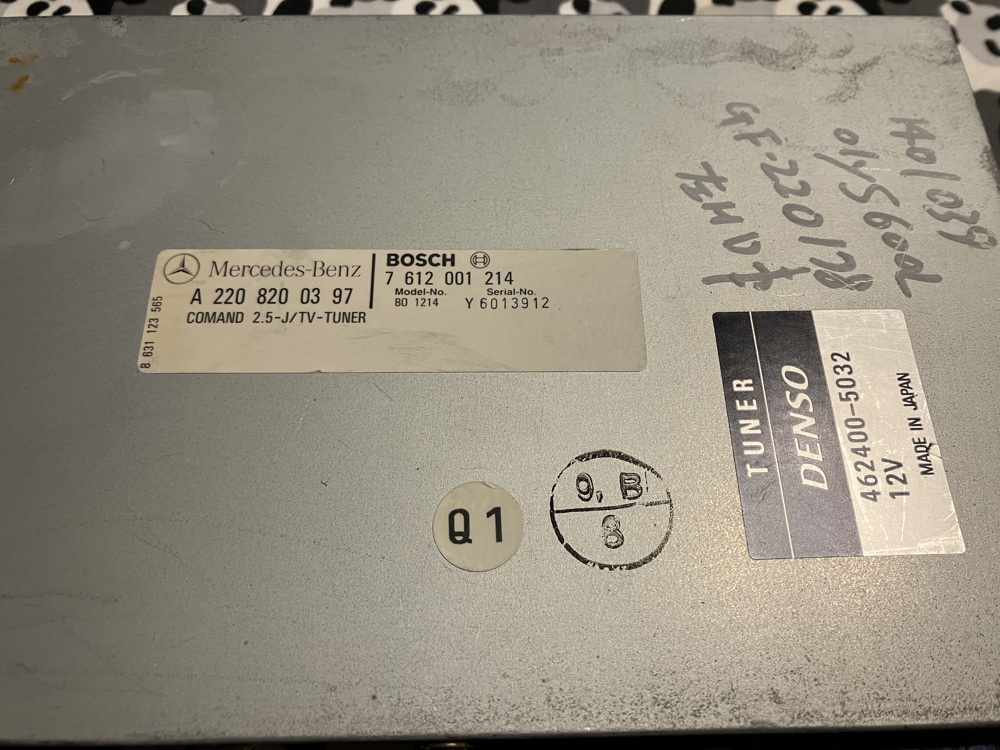
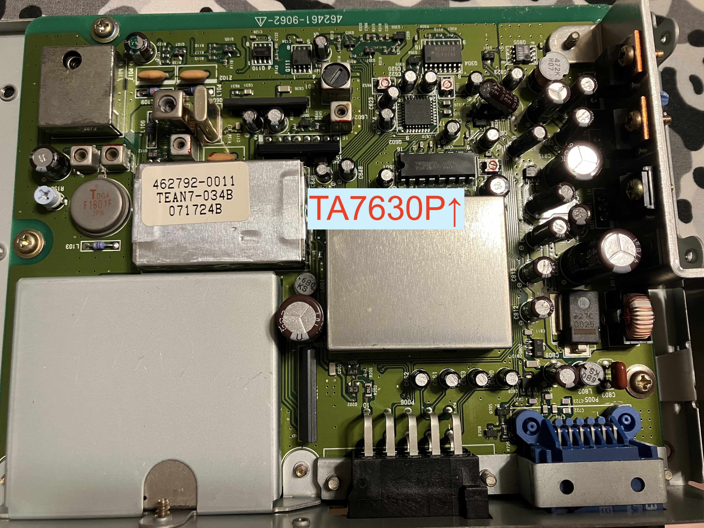
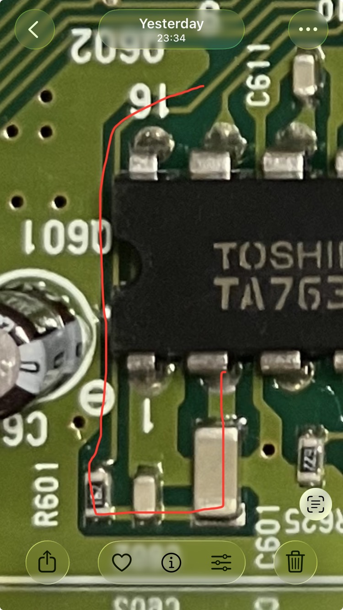

# ブツが届きました

ヤフオクで注文して、お盆で間があきましたが、とどきました。これです。
A2208200397 TVチューナーです。

フタを開けるとこうです。矢印で示したのが東芝 TA7630P というオーディオコントロールのICです。こいつを狙います。

細かい説明は省きますが、2番と15番のピンがインプットです。下の列の左から2番目が2番、その対向側が15番です。回路をたどるとコンデンサと抵抗が直列につながっています。その、抵抗の外側で基板のパタンをカットしてやり、抵抗の外側の端子に細いリード線をつけてやれば良さそうです。

というところまでで今日はタイムアップ ^^;

